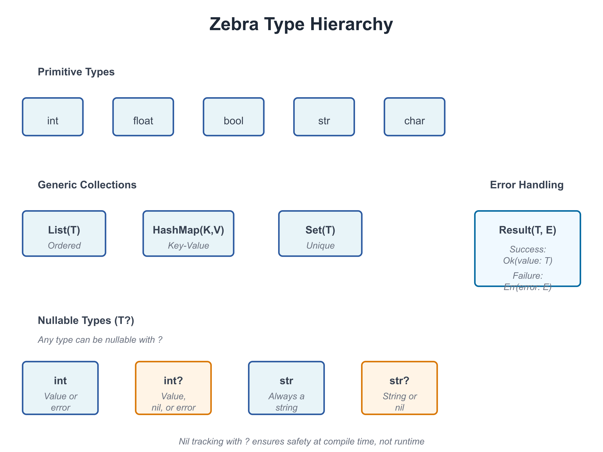

# 02: Values and Types

**Audience:** All  
**Time:** 90 minutes  
**Prerequisites:** 01-Getting-Started  
**You'll learn:** Zebra's type system, declaring variables, type inference, value vs. reference semantics

---

## The Big Picture

Every value in Zebra has a **type**. The type tells you:
- What kind of data it holds
- What operations you can perform on it
- How much memory it uses
- Whether it can be `nil`

Zebra's type system is **your best friend**—it catches mistakes at compile time instead of in production.



---

## Basic Types

### Integers

```zebra
# file: 02_integers.zbr
# teaches: integer types, arithmetic
# chapter: 02-Values-and-Types

class Main
    shared
        def main
            var age as int = 25
            var population as int = 8_000_000_000  # Underscores for readability
            var tiny as int8 = 100
            var huge as int64 = 9_223_372_036_854_775_807
            
            print age
            print population
            print tiny
            print huge
```

**Integer types:**
- `int` — Default integer (usually 64-bit)
- `int8`, `int16`, `int32`, `int64` — Specific sizes
- `uint`, `uint8`, etc. — Unsigned (non-negative) integers

**Arithmetic:**
```zebra
var x as int = 10
var y as int = 3
print x + y    # 13
print x - y    # 7
print x * y    # 30
print x / y    # 3 (integer division)
print x % y    # 1 (remainder)
```

### Floating Point

```zebra
# file: 02_floats.zbr
# teaches: float types, precision
# chapter: 02-Values-and-Types

class Main
    shared
        def main
            var pi as float = 3.14159
            var precise as float64 = 3.141592653589793
            
            print pi
            print precise
            
            # Arithmetic
            var result = pi * 2.0
            print result
```

**Float types:**
- `float` — Default floating point (usually 64-bit)
- `float32`, `float64` — Specific precision

### Booleans

```zebra
# file: 02_bools.zbr
# teaches: boolean values, logic
# chapter: 02-Values-and-Types

class Main
    shared
        def main
            var is_ready as bool = true
            var is_finished as bool = false
            
            print is_ready
            print is_finished
            
            # Logic
            print true and false   # false
            print true or false    # true
            print not true         # false
```

### Strings

```zebra
# file: 02_strings.zbr
# teaches: string type, string operations
# chapter: 02-Values-and-Types

class Main
    shared
        def main
            var greeting as str = "Hello"
            var name as str = "World"
            
            print greeting
            print greeting.len      # 5
            print greeting.upper()  # HELLO
            print name.lower()      # world
            
            # Concatenation
            var message = greeting.concat(" ").concat(name)
            print message           # Hello World
```

**String methods** (we'll cover these fully in Chapter 06):
- `.len` — Length
- `.upper()` — Uppercase
- `.lower()` — Lowercase
- `.concat()` — Concatenate
- `.contains()` — Check for substring
- `.split()` — Split by delimiter

---

## Declaring Variables

### Explicit Types

```zebra
var age as int = 25          # age must be int
var name as str = "Alice"    # name must be str
var active as bool = true    # active must be bool
```

### Type Inference

Zebra can figure out the type from the value:

```zebra
var age = 25          # Inferred as int
var name = "Alice"    # Inferred as str
var active = true     # Inferred as bool
var pi = 3.14         # Inferred as float
```

**When to use which:**
- **Use inference** — When the type is obvious (`var count = 5`)
- **Use explicit types** — When clarity matters or to prevent mistakes

```zebra
# This is confusing:
var x = compute_something()  # What type is x?

# This is clear:
var payment_amount as float = compute_something()
```

### Naming Conventions

Use `snake_case` for variables:

```zebra
var user_id as int = 42           # ✅ Good
var UserID as int = 42            # ❌ Avoid (that's for classes)
var user_id_number as int = 42    # ✅ Clear but verbose
var uid as int = 42               # ❌ Too abbreviated
```

---

## Comparison and Equality

```zebra
# file: 02_comparisons.zbr
# teaches: comparison operators
# chapter: 02-Values-and-Types

class Main
    shared
        def main
            var x as int = 10
            var y as int = 20
            
            print x == y    # false (equal)
            print x != y    # true (not equal)
            print x < y     # true (less than)
            print x > y     # false (greater than)
            print x <= y    # true (less or equal)
            print x >= y    # false (greater or equal)
            
            var name = "Alice"
            print name == "Alice"   # true
            print name == "Bob"     # false
```

---

## Type Conversions

### Implicit Conversion (When Safe)

```zebra
var small as int8 = 100
var big as int = small  # ✅ Fine: int8 → int is always safe
```

### Explicit Conversion

```zebra
# file: 02_conversions.zbr
# teaches: type conversion
# chapter: 02-Values-and-Types

class Main
    shared
        def main
            var x as int = 42
            var s = x.toString()      # int → str
            print s
            
            var pi as float = 3.14
            var i = pi.toInt()        # float → int (loses decimal)
            print i                   # 3
            
            var flag = true
            var b = flag.toString()   # bool → str
            print b                   # true
```

---

## Nullable Types (Introduction)

Sometimes a value might not exist. Zebra uses `?` to mark this:

```zebra
# file: 02_nullables.zbr
# teaches: nullable types introduction
# chapter: 02-Values-and-Types

class Main
    shared
        def main
            var name as str? = "Alice"    # Can hold str or nil
            var empty as str? = nil       # Explicitly nil
            
            # You must check before using
            if name != nil
                print name                # Safe to use
            
            if empty != nil
                print empty
            else
                print "Name is empty"
```

**Key point:** `str?` means "string or nil". We'll explore nil tracking fully in Chapter 11.

### If you're new to programming

> A **nullable type** is like an optional value. Sometimes you have it, sometimes you don't.
> Instead of errors when it's missing, Zebra lets you check first.

---

## Type Mismatch Errors

Zebra prevents mixing types unsafely:

```zebra
var x as int = "hello"  # ❌ Error: can't assign str to int
var y as str = 42       # ❌ Error: can't assign int to str
var z as int = 3.14     # ❌ Error: can't assign float to int
```

**Why?** Type safety catches bugs before they happen. You can't accidentally treat a string as a number.

---

## Real World: Processing User Data

```zebra
# file: 02_user_data.zbr
# teaches: realistic variable use
# chapter: 02-Values-and-Types

class User
    var id as int
    var name as str
    var email as str
    var age as int
    var is_active as bool

class Main
    shared
        def main
            # Create a user
            var user = User()
            user.id = 1
            user.name = "Alice"
            user.email = "alice@example.com"
            user.age = 30
            user.is_active = true
            
            # Display
            print "User: ${user.name}"
            print "Email: ${user.email}"
            print "Age: ${user.age}"
            print "Active: ${user.is_active}"
```

---

## Common Mistakes

> ❌ **Mistake:** Forgetting `as type` when the type isn't obvious
>
> ```zebra
> var result = compute()  # What's the type?
> ```
>
> 💡 **Why it's wrong:** Readers (including future you) don't know what type `result` is.
>
> ✅ **Better:**
> ```zebra
> var result as int = compute()  # Clear: it's an int
> ```

> ❌ **Mistake:** Mixing types in arithmetic
>
> ```zebra
> var x as int = 10
> var y as float = 3.14
> print x + y  # ❌ Can't add int + float
> ```
>
> 💡 **Why:** Different types might need different handling.
>
> ✅ **Better:**
> ```zebra
> var x as float = 10.0
> var y as float = 3.14
> print x + y  # ✅ Both float
> ```

> ❌ **Mistake:** Using a nullable type without checking
>
> ```zebra
> var name as str? = nil
> print name.upper()  # ❌ Error: nil doesn't have .upper()
> ```
>
> ✅ **Better:**
> ```zebra
> var name as str? = nil
> if name != nil
>     print name.upper()  # Safe
> ```

---

## Exercises

### Exercise 1: Type Conversion

Write a program that:
1. Creates an integer variable
2. Creates a float variable
3. Converts both to strings
4. Prints them

<details>
<summary>Solution</summary>

```zebra
class Main
    shared
        def main
            var count as int = 42
            var price as float = 19.99
            
            var count_str = count.toString()
            var price_str = price.toString()
            
            print "Count: ${count_str}"
            print "Price: ${price_str}"
```

**Output:**
```
Count: 42
Price: 19.99
```

</details>

### Exercise 2: Comparisons

Write a program that compares two numbers and prints which is larger:

<details>
<summary>Solution</summary>

```zebra
class Main
    shared
        def main
            var x as int = 100
            var y as int = 75
            
            if x > y
                print "${x} is larger than ${y}"
            else
                print "${y} is larger than ${x}"
```

**Output:**
```
100 is larger than 75
```

</details>

### Exercise 3: User Profile

Create a data structure to hold user information (name, age, email) and print a profile:

<details>
<summary>Solution</summary>

```zebra
class Person
    var name as str
    var age as int
    var email as str

class Main
    shared
        def main
            var person = Person()
            person.name = "Carol"
            person.age = 28
            person.email = "carol@example.com"
            
            print "Name: ${person.name}"
            print "Age: ${person.age}"
            print "Email: ${person.email}"
```

</details>

---

## Next Steps

- → **03-Collections** — Lists and HashMaps
- → **04-Functions** — Write reusable code
- → **11-Nil-Tracking** — Deep dive into nullable types

---

## Key Takeaways

- **Every value has a type** — Integers, floats, booleans, strings, and more
- **Types are checked at compile time** — Catches bugs early
- **Use type inference when obvious, explicit types when clarity matters**
- **Conversions are explicit** — No silent type changes
- **Nullable types use `?`** — `str?` can be string or nil
- **Always check nil before using** — `if value != nil { ... }`

---

**Next:** Head to **03-Collections** to learn Lists and HashMaps.
