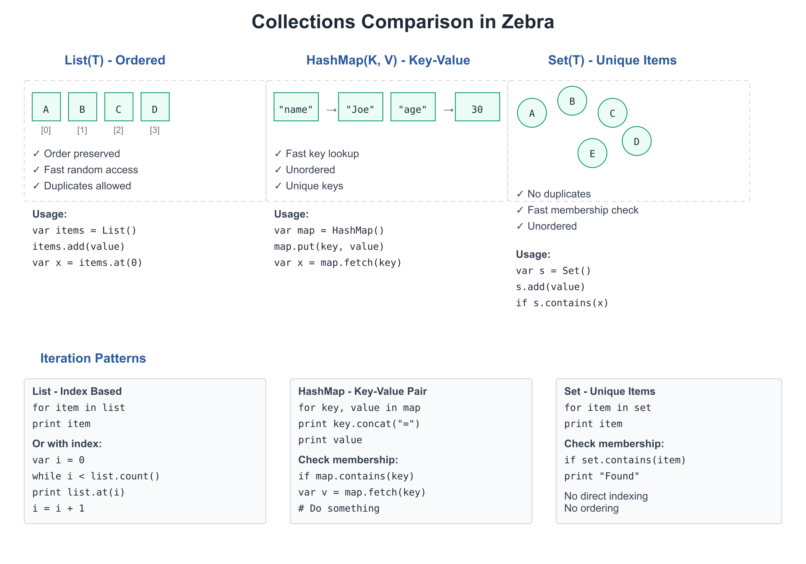

# 03: Collections

**Audience:** All  
**Time:** 120 minutes  
**Prerequisites:** 01-Getting-Started, 02-Values-and-Types  
**You'll learn:** Lists, HashMaps, Sets, iteration, indexing, collection methods

---

## The Big Picture

Collections let you group values. Instead of declaring 100 separate variables for 100 names, you use one `List(str)` that holds all 100.

Zebra provides:
- **List(T)** — Ordered, resizable sequences (like Python's list)
- **HashMap(K, V)** — Key-value pairs (like Python's dict)
- **Set(T)** — Unique values (like Python's set)



---

## Lists

A `List` holds multiple values of the same type in order.

### Creating Lists

```zebra
# file: 03_lists.zbr
# teaches: list creation and access
# chapter: 03-Collections

class Main
    shared
        def main
            # Create an empty list
            var fruits as List(str) = List()
            
            # Add items
            fruits.add("apple")
            fruits.add("banana")
            fruits.add("cherry")
            
            # Access by index
            print fruits.at(0)   # apple
            print fruits.at(1)   # banana
            
            # Check size
            print fruits.count() # 3
            
            # Iterate
            for fruit in fruits
                print fruit
```

### List Operations

```zebra
# file: 03_list_ops.zbr
# teaches: list manipulation
# chapter: 03-Collections

class Main
    shared
        def main
            var nums as List(int) = List()
            nums.add(10)
            nums.add(20)
            nums.add(30)
            
            # Check existence
            var has_twenty = nums.contains(20)
            print has_twenty                    # true
            
            # Find index
            var idx = nums.indexOf(20)
            print idx                           # 1
            
            # Remove
            nums.remove(20)
            print nums.count()                  # 2
            
            # Clear
            nums.clear()
            print nums.count()                  # 0
```

### Iteration Patterns

```zebra
# file: 03_iteration.zbr
# teaches: different iteration styles
# chapter: 03-Collections

class Main
    shared
        def main
            var items as List(str) = List()
            items.add("first")
            items.add("second")
            items.add("third")
            
            # Simple iteration
            for item in items
                print item
            
            # Iteration with index (if supported)
            var i = 0
            while i < items.count()
                print "${i}: ${items.at(i)}"
                i = i + 1
```

### If you're new to programming

> A **List** is like a numbered shelf. You can:
> - Add items: `list.add(item)`
> - Take items: `list.remove(item)`  
> - Check what's there: `list.at(0)` gets the first item
> - Count items: `list.count()`

### If you know Python

```python
# Python
fruits = ["apple", "banana"]
fruits.append("cherry")
for fruit in fruits:
    print(fruit)

# Zebra
var fruits as List(str) = List()
fruits.add("apple")
fruits.add("banana")
fruits.add("cherry")
for fruit in fruits
    print fruit
```

The main difference: Zebra requires explicit type (`List(str)`) while Python infers it.

---

## HashMaps

A `HashMap` stores key-value pairs. Fast lookup by key.

### Creating and Using HashMaps

```zebra
# file: 03_hashmaps.zbr
# teaches: hashmap creation and access
# chapter: 03-Collections

class Main
    shared
        def main
            # Create empty HashMap
            var ages as HashMap(str, int) = HashMap()
            
            # Add key-value pairs
            ages.set("Alice", 30)
            ages.set("Bob", 25)
            ages.set("Carol", 28)
            
            # Retrieve by key
            var alice_age = ages.get("Alice")
            print alice_age                     # 30
            
            # Check if key exists
            var has_alice = ages.contains("Alice")
            print has_alice                     # true
            
            # Iterate
            for name, age in ages
                print "${name}: ${age}"
```

### HashMap Operations

```zebra
# file: 03_hashmap_ops.zbr
# teaches: hashmap manipulation
# chapter: 03-Collections

class Main
    shared
        def main
            var config as HashMap(str, str) = HashMap()
            config.set("host", "localhost")
            config.set("port", "8080")
            config.set("debug", "true")
            
            # Count entries
            print config.count()                # 3
            
            # Remove entry
            config.remove("debug")
            print config.count()                # 2
            
            # Check contains
            if config.contains("host")
                print config.get("host")      # localhost
            
            # Iterate over keys and values
            for key, value in config
                print "${key} = ${value}"
```

### If you know Python

```python
# Python
ages = {"Alice": 30, "Bob": 25}
print(ages["Alice"])
for name, age in ages.items():
    print(name, age)

# Zebra
var ages as HashMap(str, int) = HashMap()
ages.put("Alice", 30)
ages.put("Bob", 25)
print ages.fetch("Alice")
for name, age in ages
    print "${name} ${age}"
```

---

## Deduplication with HashMap

Need unique values? Use a `HashMap` where keys track membership:

```zebra
# file: 03_dedup.zbr
# teaches: using HashMap for uniqueness
# chapter: 03-Collections

class Main
    shared
        def main
            var seen as HashMap(int, bool) = HashMap()
            var unique as List(int) = List()
            
            var ids as List(int) = List()
            ids.add(1)
            ids.add(2)
            ids.add(3)
            ids.add(2)    # Duplicate
            
            for id in ids
                if not seen.contains(id)
                    seen.set(id, true)
                    unique.add(id)
            
            print unique.count()    # 3
            
            # Check membership
            print seen.contains(2)  # true
```

---

## Real World: Data Processing

```zebra
# file: 03_real_world.zbr
# teaches: collections in realistic scenarios
# chapter: 03-Collections

class Student
    var name as str
    var gpa as float

class Main
    shared
        def main
            # List of students
            var students as List(Student) = List()
            
            var alice = Student()
            alice.name = "Alice"
            alice.gpa = 3.9
            students.add(alice)
            
            var bob = Student()
            bob.name = "Bob"
            bob.gpa = 3.5
            students.add(bob)
            
            # Calculate average GPA
            var total = 0.0
            for student in students
                total = total + student.gpa
            var average = total / students.count()
            print "Average GPA: ${average}"
            
            # Find student by name
            var target_name = "Alice"
            for student in students
                if student.name == target_name
                    print "Found: ${student.name} (${student.gpa})"
```

---

## Common Patterns

### Filter and Transform

```zebra
# file: 03_patterns.zbr
# teaches: collection patterns
# chapter: 03-Collections

class Main
    shared
        def main
            var numbers as List(int) = List()
            numbers.add(1)
            numbers.add(2)
            numbers.add(3)
            numbers.add(4)
            numbers.add(5)
            
            # Filter: keep only even numbers
            var evens as List(int) = List()
            for num in numbers
                if num % 2 == 0
                    evens.add(num)
            
            print "Evens: "
            for e in evens
                print e
            
            # Count matching items
            var count_gt_3 = 0
            for num in numbers
                if num > 3
                    count_gt_3 = count_gt_3 + 1
            print "Numbers > 3: ${count_gt_3}"
```

---

## Common Mistakes

> ❌ **Mistake:** Forgetting type parameters
>
> ```zebra
> var items = List()  # What type? List(what)?
> ```
>
> ✅ **Better:**
> ```zebra
> var items as List(str) = List()  # Clear: list of strings
> ```

> ❌ **Mistake:** Iterating and modifying
>
> ```zebra
> for item in items
>     items.remove(item)  # ❌ Unsafe: modifying while iterating
> ```
>
> ✅ **Better:**
> ```zebra
> var to_remove as List(str) = List()
> for item in items
>     if should_remove(item)
>         to_remove.add(item)
> for item in to_remove
>     items.remove(item)
> ```

> ❌ **Mistake:** Using wrong key type for HashMap
>
> ```zebra
> var map as HashMap(str, int) = HashMap()
> map.set(1, 100)  # ❌ Key should be str, not int
> ```
>
> ✅ **Better:**
> ```zebra
> var map as HashMap(str, int) = HashMap()
> map.set("count", 100)  # ✅ Key is str
> ```

---

## Exercises

### Exercise 1: List Operations

Create a list of numbers and find the sum:

<details>
<summary>Solution</summary>

```zebra
class Main
    shared
        def main
            var nums as List(int) = List()
            nums.add(10)
            nums.add(20)
            nums.add(30)
            nums.add(40)
            
            var sum = 0
            for num in nums
                sum = sum + num
            
            print "Sum: ${sum}"  # 100
```

</details>

### Exercise 2: HashMap Lookup

Create a phone book and look up a number:

<details>
<summary>Solution</summary>

```zebra
class Main
    shared
        def main
            var phone_book as HashMap(str, str) = HashMap()
            phone_book.set("Alice", "555-1234")
            phone_book.set("Bob", "555-5678")
            phone_book.set("Carol", "555-9999")
            
            var name = "Bob"
            if phone_book.contains(name)
                print "${name}'s number: ${phone_book.get(name)}"
```

</details>

### Exercise 3: Unique Words

Count unique words in a sentence (using HashMap for deduplication):

<details>
<summary>Solution</summary>

```zebra
class Main
    shared
        def main
            var text = "the quick brown fox jumps over the lazy dog"
            var words = text.split(" ")
            
            var seen as HashMap(str, bool) = HashMap()
            for word in words
                seen.set(word, true)
            
            print "Total words: ${words.count()}"
            print "Unique words: ${seen.count()}"
```

</details>

---

## Next Steps

- → **04-Functions** — Reuse collection-processing code
- → **05-Control-Flow** — Pattern matching on collections
- 🏋️ **Project-3-Data-Analysis** — Real collection processing

---

## Key Takeaways

- **List(T)** holds ordered items, access by index
- **HashMap(K,V)** holds key-value pairs, fast lookup
- **Deduplication** — use HashMap keys for unique-value tracking
- **Iteration** with `for item in collection` is the main pattern
- **Type parameters** are required: `List(str)` not just `List`
- **Modifying while iterating** is unsafe; collect changes first

---

**Next:** Head to **04-Functions** to write reusable code.
