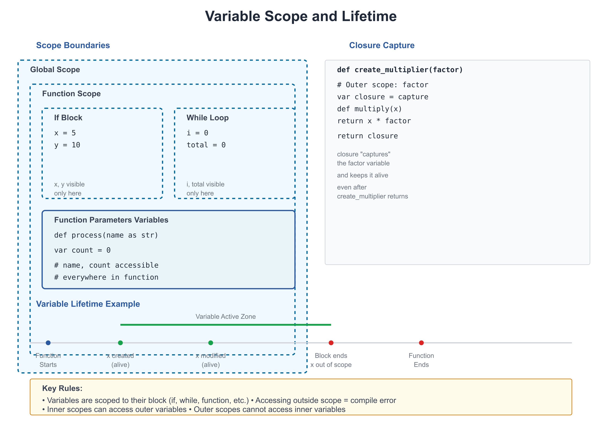

# 04: Functions and Scope

**Audience:** All  
**Time:** 120 minutes  
**Prerequisites:** 01-02-03  
**You'll learn:** Define functions, parameters, return values, scope, closures, capture blocks

---

## The Big Picture

Functions let you:
- **Reuse code** — Write once, call many times
- **Organize logic** — Group related operations
- **Name ideas** — `process_payment()` is clearer than inline logic
- **Test parts** — Functions are easier to test in isolation

---

## Basic Functions

### Defining Functions

```zebra
# file: 04_functions.zbr
# teaches: function definition and calling
# chapter: 04-Functions-and-Scope

class Math
    shared
        def add(a as int, b as int) as int
            return a + b
        
        def multiply(x as int, y as int) as int
            return x * y

class Main
    shared
        def main
            var result1 = Math.add(5, 3)
            print result1                       # 8
            
            var result2 = Math.multiply(4, 7)
            print result2                       # 28
```

**Breakdown:**
- `def add(...)` — Define a function named `add`
- `(a as int, b as int)` — Parameters: `a` and `b`, both integers
- `as int` — Return type is integer
- `return a + b` — The value to return

### Functions With Multiple Parameters

```zebra
# file: 04_multi_params.zbr
# teaches: multiple parameters
# chapter: 04-Functions-and-Scope

class String
    shared
        def pad(text as str, width as int, fill as str) as str
            # (Implementation would go here)
            return text

class Main
    shared
        def main
            var padded = String.pad("hi", 10, "*")
            print padded
```

### Optional Logic (No Return Value)

```zebra
# file: 04_void.zbr
# teaches: functions that don't return values
# chapter: 04-Functions-and-Scope

class Logger
    shared
        def log(message as str)
            print "[LOG] ${message}"

class Main
    shared
        def main
            Logger.log("Application started")
            Logger.log("Processing data")
            Logger.log("Done")
```

When a function doesn't return a value, just omit `as <type>`.

---

## Scope

**Scope** is where a variable can be accessed.



### Local Scope

Variables declared inside a function are local (only accessible there):

```zebra
# file: 04_scope.zbr
# teaches: variable scope
# chapter: 04-Functions-and-Scope

class Calculator
    shared
        var global_val as int = 100  # Shared (class-level)
        
        def compute
            var local_val as int = 50  # Local to this function
            print local_val             # ✅ Can access
            print global_val            # ✅ Can access class-level
        
        def other
            # print local_val  # ❌ Can't access, it's not here

class Main
    shared
        def main
            Calculator.compute()
```

### Shadowing (Careful!)

```zebra
class Example
    shared
        var count as int = 10  # Class-level
        
        def show
            var count as int = 5  # Local (shadows class variable)
            print count           # 5 (local shadows class)
            
        def another
            print count           # 10 (uses class-level)
```

Shadowing can be confusing. Rename to clarify intent.

### If you're new to programming

> **Scope** determines where you can use a variable.
> - **Local:** Only inside the function where it's declared
> - **Class-level:** Accessible from all functions in the class

---

## Closures and Capture

Functions can create inner functions that capture outer variables:

```zebra
# file: 04_closures.zbr
# teaches: closures and variable capture
# chapter: 04-Functions-and-Scope

class Multiplier
    shared
        def make_multiplier(factor as int) as def(int)
            return def(x as int)
                capture
                    var factor as int = factor
                return x * factor

class Main
    shared
        def main
            var double = Multiplier.make_multiplier(2)
            var triple = Multiplier.make_multiplier(3)
            
            print double(5)             # 10
            print triple(5)             # 15
```

**What's happening:**
1. `make_multiplier(2)` creates a function that multiplies by 2
2. `double = ...` stores that function in a variable
3. `double(5)` calls it: 5 * 2 = 10

The `capture` block explicitly captures `factor` from the outer scope.

### Capture Syntax

```zebra
# file: 04_capture.zbr
# teaches: capture blocks
# chapter: 04-Functions-and-Scope

class Counter
    shared
        def make_counter
            var count as int = 0
            return def()
                capture
                    var count as int = count
                count = count + 1
                return count

class Main
    shared
        def main
            var counter = Counter.make_counter()
            print counter()             # 1
            print counter()             # 2
            print counter()             # 3
```

---

## Real World: Reusable Utilities

```zebra
# file: 04_utilities.zbr
# teaches: practical function use
# chapter: 04-Functions-and-Scope

class String
    shared
        def repeat(text as str, times as int) as str
            var result = ""
            var i = 0
            while i < times
                result = result.concat(text)
                i = i + 1
            return result
        
        def pad_left(text as str, width as int) as str
            var padding_needed = width - text.len
            if padding_needed <= 0
                return text
            var padding = repeat(" ", padding_needed)
            return padding.concat(text)

class Main
    shared
        def main
            var padded = String.pad_left("hello", 10)
            print "[${padded}]"         # [     hello]
```

---

## Common Patterns

### Early Return

```zebra
# file: 04_patterns.zbr
# teaches: early return pattern
# chapter: 04-Functions-and-Scope

class Validator
    shared
        def validate_email(email as str) as bool
            if email.len == 0
                return false
            if not email.contains("@")
                return false
            if not email.contains(".")
                return false
            return true
```

### Default Arguments (Via Overload)

Zebra doesn't have default arguments, but you can create multiple versions:

```zebra
class Print
    shared
        def log(message as str)
            log(message, "[INFO]")
        
        def log(message as str, prefix as str)
            print "${prefix} ${message}"
```

### Passing Functions As Arguments

```zebra
# file: 04_higher_order.zbr
# teaches: functions as arguments
# chapter: 04-Functions-and-Scope

class Array
    shared
        def map(items as List(int), transform as def(int))
            var result as List(int) = List()
            for item in items
                var transformed = transform(item)
                result.add(transformed)
            return result

class Main
    shared
        def main
            var nums as List(int) = List()
            nums.add(1)
            nums.add(2)
            nums.add(3)
            
            var double_it = def(x as int) = x * 2
            var doubled = Array.map(nums, double_it)
            
            for d in doubled
                print d                 # 2, 4, 6
```

---

## Common Mistakes

> ❌ **Mistake:** Returning wrong type
>
> ```zebra
> def get_age as int
>     return "25"  # ❌ Returning str, not int
> ```
>
> ✅ **Better:**
> ```zebra
> def get_age as int
>     return 25    # ✅ Returning int
> ```

> ❌ **Mistake:** Using variable outside its scope
>
> ```zebra
> def process
>     var data = fetch_data()
>
> def use
>     print data  # ❌ data doesn't exist here
> ```
>
> ✅ **Better:**
> ```zebra
> def process as str
>     var data = fetch_data()
>     return data
>
> def use
>     var data = process()
>     print data  # ✅ data is here
> ```

> ❌ **Mistake:** Forgetting to return
>
> ```zebra
> def compute as int
>     var result = 5 + 3
>     # Forgot return!
> ```
>
> ✅ **Better:**
> ```zebra
> def compute as int
>     var result = 5 + 3
>     return result
> ```

---

## Exercises

### Exercise 1: Simple Function

Write a function that calculates the factorial of a number:

<details>
<summary>Solution</summary>

```zebra
class Math
    shared
        def factorial(n as int) as int
            if n <= 1
                return 1
            return n * factorial(n - 1)

class Main
    shared
        def main
            print Math.factorial(5)     # 120
```

</details>

### Exercise 2: Closure

Create a function that returns an "adder" function:

<details>
<summary>Solution</summary>

```zebra
class Adder
    shared
        def make_adder(base as int) as def(int)
            return def(x as int)
                capture
                    var base as int = base
                return x + base

class Main
    shared
        def main
            var add_10 = Adder.make_adder(10)
            print add_10(5)              # 15
            print add_10(20)             # 30
```

</details>

### Exercise 3: Filtering

Write a function that filters a list:

<details>
<summary>Solution</summary>

```zebra
class Filter
    shared
        def even_numbers(nums as List(int)) as List(int)
            var evens as List(int) = List()
            for num in nums
                if num % 2 == 0
                    evens.add(num)
            return evens

class Main
    shared
        def main
            var nums as List(int) = List()
            nums.add(1)
            nums.add(2)
            nums.add(3)
            nums.add(4)
            nums.add(5)
            
            var result = Filter.even_numbers(nums)
            for r in result
                print r
```

</details>

---

## Next Steps

- → **05-Control-Flow** — if/else, loops, pattern matching
- → **15-Pipelines** — Function composition
- 🏋️ **Project-1-CLI-Tool** — Use functions extensively

---

## Key Takeaways

- **Functions are reusable blocks** of code with clear inputs and outputs
- **Scope** determines where variables can be accessed
- **Closures** capture outer variables for use in inner functions
- **Early return** makes logic clearer
- **Functions as arguments** enable powerful abstractions
- **Name functions well** — `process_payment()` is better than `do_thing()`

---

**Next:** Head to **05-Control-Flow** to learn if/else, loops, and pattern matching.
