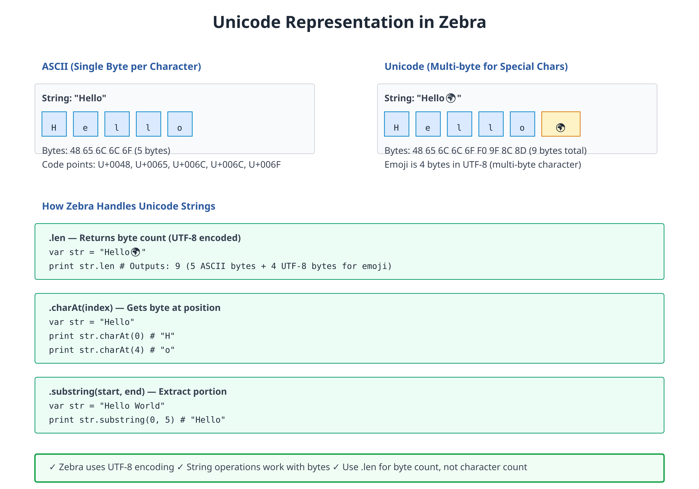

# 06: Strings and Unicode

**Audience:** All  
**Time:** 90 minutes  
**Prerequisites:** 01-05  
**You'll learn:** String operations, Unicode, formatting, pattern matching with regex

---

## The Big Picture

**Strings** are how programs work with text. Zebra treats strings as:
- **Unicode-aware** — Emoji, Chinese, Arabic, etc. all work correctly
- **First-class** — Rich library of methods
- **Immutable** — Can't change them after creation (create new ones instead)
- **Efficient** — UTF-8 encoding optimizes storage

---

## String Basics

### String Literals

```zebra
# file: 06_string_basics.zbr
# teaches: string creation
# chapter: 06-Strings-and-Unicode

class Main
    shared
        def main
            # Simple string
            var greeting = "Hello"
            print greeting
            
            # With quotes inside
            var quoted = "She said \"Hello\""
            print quoted
            
            # Multi-line (if supported)
            var poem = """
            Roses are red
            Violets are blue
            """
            print poem
            
            # Escape sequences
            var path = "C:\\Users\\Name\\Documents"
            var tab = "Name\tAge\tCity"
            var newline = "Line1\nLine2"
```

### String Properties

```zebra
# file: 06_string_props.zbr
# teaches: string properties and methods
# chapter: 06-Strings-and-Unicode

class Main
    shared
        def main
            var text = "Hello, World!"
            
            # Length
            print text.len                      # 13
            
            # Character at index
            var first_char = text[0]
            print first_char                    # H
            
            # Substring/slice
            var part = text[0..4]
            print part                          # Hello
            
            # Case conversion
            print text.upper()                  # HELLO, WORLD!
            print text.lower()                  # hello, world!
```

### String Interpolation

```zebra
# file: 06_interpolation.zbr
# teaches: string interpolation
# chapter: 06-Strings-and-Unicode

class Main
    shared
        def main
            var name = "Alice"
            var age = 30
            
            # Simple interpolation
            print "Name: ${name}"               # Name: Alice
            
            # Expressions in interpolation
            print "Age next year: ${age + 1}"   # Age next year: 31
            
            # Method calls
            var lower_name = name.lower()
            print "Lowercase: ${lower_name}"    # Lowercase: alice
            
            # Format specifiers (if supported)
            var price = 19.99
            print "Price: ${price:.2f}"         # Price: 19.99
```

---

## String Methods

### Searching

```zebra
# file: 06_search.zbr
# teaches: searching in strings
# chapter: 06-Strings-and-Unicode

class Main
    shared
        def main
            var text = "Hello, World!"
            
            # Contains
            print text.contains("World")        # true
            print text.contains("xyz")          # false
            
            # Index
            var idx = text.indexOf("World")
            print idx                           # 7
            
            # Not found returns -1 or special value
            var not_found = text.indexOf("xyz")
            print not_found
            
            # Starts/ends with
            print text.startsWith("Hello")      # true
            print text.endsWith("!")            # true
```

### Splitting and Joining

```zebra
# file: 06_split_join.zbr
# teaches: splitting and joining strings
# chapter: 06-Strings-and-Unicode

class Main
    shared
        def main
            # Split
            var csv = "apple,banana,cherry"
            var fruits = csv.split(",")
            for fruit in fruits
                print fruit
            
            # Join
            var items as List(str) = List()
            items.add("one")
            items.add("two")
            items.add("three")
            var result = ", ".join(items)
            print result                        # one, two, three
```

### Trimming and Padding

```zebra
# file: 06_trim_pad.zbr
# teaches: trimming and padding
# chapter: 06-Strings-and-Unicode

class Main
    shared
        def main
            var padded = "  hello  "
            
            # Trim whitespace
            print "|${padded.trim()}|"          # |hello|
            print "|${padded.trimLeft()}|"      # |hello  |
            print "|${padded.trimRight()}|"     # |  hello|
            
            # Padding
            var short = "hi"
            print short.padLeft(10, "*")        # ********hi
            print short.padRight(10, "-")       # hi--------
            print short.center(10, "*")         # ****hi****
```

### Replacing

```zebra
# file: 06_replace.zbr
# teaches: string replacement
# chapter: 06-Strings-and-Unicode

class Main
    shared
        def main
            var text = "cat and dog and bird"
            
            # Replace (first occurrence, or all)
            var once = text.replace("and", "or")      # Replaces once
            print once
            
            var all = text.replaceAll("and", "or")    # Replaces all
            print all
            
            # Case conversion replacement
            var lower = "Hello World".lower()
            print lower                         # hello world
```

---

## Unicode and Internationalization



### Unicode Basics

```zebra
# file: 06_unicode.zbr
# teaches: unicode support
# chapter: 06-Strings-and-Unicode

class Main
    shared
        def main
            # Emoji
            var emoji = "Hello 👋 🌍 🎉"
            print emoji
            print emoji.len                     # Byte length
            print emoji.codePointCount()        # Character count
            
            # Chinese
            var chinese = "你好世界"  # Hello World in Chinese
            print chinese
            
            # Arabic (right-to-left)
            var arabic = "مرحبا بالعالم"  # Hello World
            print arabic
            
            # Mixed scripts
            var mixed = "Hello 世界 مرحبا"
            print mixed
```

### Character Iteration

```zebra
# file: 06_char_iter.zbr
# teaches: iterating over characters
# chapter: 06-Strings-and-Unicode

class Main
    shared
        def main
            var text = "Hello"
            
            # Iterate characters
            for char in text.chars()
                print char
            
            # Byte iteration
            var data = "AB"
            for byte in data.bytes()
                print byte                      # 65, 66 (ASCII values)
```

---

## Regular Expressions (Intro)

Regular expressions let you search and validate text patterns.

### Basic Patterns

```zebra
# file: 06_regex_intro.zbr
# teaches: regular expressions introduction
# chapter: 06-Strings-and-Unicode

class Main
    shared
        def main
            # Simple pattern
            var email = "alice@example.com"
            var pattern = Regex.compile("[a-z]+@[a-z]+\\.[a-z]+")
            
            var is_valid = pattern.match(email)
            print is_valid                      # true
            
            # Find matches
            var text = "I have 2 apples and 3 oranges"
            var digit_pattern = Regex.compile("\\d+")
            var found = digit_pattern.find(text)
            print found                         # 2
            
            # Replace
            var clean = digit_pattern.replace(text, "X")
            print clean                         # I have X apples and X oranges
```

---

## Real World: Text Processing

```zebra
# file: 06_text_processing.zbr
# teaches: practical text operations
# chapter: 06-Strings-and-Unicode

class Parser
    shared
        def parse_csv_line(line as str) as List(str)
            return line.split(",")
        
        def normalize_whitespace(text as str) as str
            # Replace multiple spaces with one
            var lines as List(str) = List()
            for line in text.split("\n")
                var trimmed = line.trim()
                if trimmed.len > 0
                    lines.add(trimmed)
            return "\n".join(lines)
        
        def extract_numbers(text as str) as List(str)
            var results as List(str) = List()
            var pattern = Regex.compile("\\d+")
            for match in pattern.findAll(text)
                results.add(match)
            return results

class Main
    shared
        def main
            # Parse CSV
            var csv_line = "Alice,30,alice@example.com"
            var fields = Parser.parse_csv_line(csv_line)
            print "Name: ${fields.at(0)}"
            print "Age: ${fields.at(1)}"
            
            # Extract numbers
            var text = "I was born in 1990 and moved in 2005"
            var years = Parser.extract_numbers(text)
            for year in years
                print year
```

---

## Common Patterns

### Email Validation

```zebra
def is_valid_email(email as str) as bool
    if not email.contains("@")
        return false
    var parts = email.split("@")
    if parts.count() != 2
        return false
    if not parts.at(1).contains(".")
        return false
    return true
```

### URL Parsing

```zebra
def parse_url(url as str) as HashMap(str, str)
    var result as HashMap(str, str) = HashMap()
    var parts = url.split("://")
    if parts.count() == 2
        result.set("protocol", parts.at(0))
    return result
```

### String Templating

```zebra
def template(text as str, values as HashMap(str, str)) as str
    var result = text
    for key, value in values
        var placeholder = "${${key}}"
        result = result.replace(placeholder, value)
    return result
```

---

## Common Mistakes

> ❌ **Mistake:** Forgetting that strings are immutable
>
> ```zebra
> var text = "hello"
> text[0] = 'H'  # ❌ Can't modify
> ```
>
> ✅ **Better:**
> ```zebra
> var text = "hello"
> var capitalized = "H".concat(text[1..])
> ```

> ❌ **Mistake:** Ignoring Unicode length
>
> ```zebra
> var emoji = "👋"
> print emoji.len  # ❌ Returns 4 (bytes), not 1
> ```
>
> ✅ **Better:**
> ```zebra
> var emoji = "👋"
> print emoji.codePointCount()  # ✅ Returns 1 (characters)
> ```

> ❌ **Mistake:** Inefficient concatenation in loops
>
> ```zebra
> var result = ""
> for i in 1..1000
>     result = result + "${i},"  # ❌ O(n²) complexity
> ```
>
> ✅ **Better:**
> ```zebra
> var sb as StringBuilder = StringBuilder()
> for i in 1..1000
>     sb.append("${i},")
> var result = sb.build()  # ✅ O(n) complexity
> ```

---

## Exercises

### Exercise 1: String Reversal

Write a function that reverses a string:

<details>
<summary>Solution</summary>

```zebra
class Reverser
    shared
        def reverse(text as str) as str
            var chars as List(str) = List()
            for c in text.chars()
                chars.add(c.toString())
            
            var result = ""
            var i = chars.count() - 1
            while i >= 0
                result = result.concat(chars.at(i))
                i = i - 1
            return result

class Main
    shared
        def main
            var reversed = Reverser.reverse("hello")
            print reversed  # olleh
```

</details>

### Exercise 2: Email Validator

Write a simple email validator:

<details>
<summary>Solution</summary>

```zebra
class Validator
    shared
        def is_valid_email(email as str) as bool
            if email.len < 5
                return false
            if not email.contains("@")
                return false
            if not email.contains(".")
                return false
            var parts = email.split("@")
            if parts.count() != 2
                return false
            if parts.at(1).len < 3
                return false
            return true

class Main
    shared
        def main
            var emails as List(str) = List()
            emails.add("alice@example.com")
            emails.add("invalid")
            emails.add("bob@domain.co")
            
            for email in emails
                if Validator.is_valid_email(email)
                    print "Valid: ${email}"
                else
                    print "Invalid: ${email}"
```

</details>

### Exercise 3: CSV Parsing

Parse a CSV line and extract fields:

<details>
<summary>Solution</summary>

```zebra
class CSVParser
    shared
        def parse(line as str) as List(str)
            return line.split(",")
        
        def parse_with_trim(line as str) as List(str)
            var raw = line.split(",")
            var trimmed as List(str) = List()
            for field in raw
                trimmed.add(field.trim())
            return trimmed

class Main
    shared
        def main
            var csv = "Alice, 30, NYC"
            var fields = CSVParser.parse_with_trim(csv)
            for field in fields
                print "|${field}|"
```

</details>

---

## Next Steps

- → **07-Classes** — Object-oriented programming
- → **18-Regular-Expressions** — Deep dive into regex
- 🏋️ **Project-1-CLI-Tool** — Text processing practical application

---

## Key Takeaways

- **Strings are immutable** — Create new ones instead of modifying
- **Interpolation is readable** — Use `"${var}"` over concatenation
- **Methods are rich** — `.split()`, `.replace()`, `.trim()`, etc.
- **Unicode works seamlessly** — emoji, Chinese, Arabic, etc.
- **Regex enables pattern matching** — For validation and extraction
- **StringBuilder is efficient** — Use for loop-based concatenation

---

**Next:** Head to **Part 2** for object-oriented programming with **07-Classes**.
