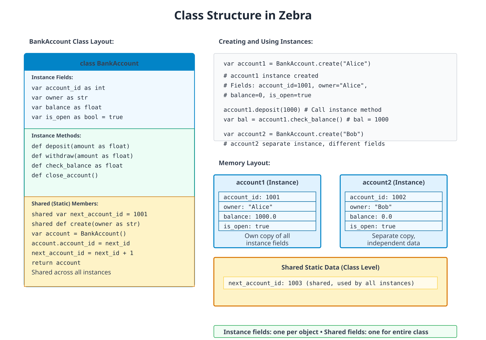

# 07: Classes and Instances

**Audience:** All (with beginner sidebar)  
**Time:** 120 minutes  
**Prerequisites:** 01-06  
**You'll learn:** Define classes, instantiate objects, instance methods, fields, initialization

---

## The Big Picture

**Classes** are blueprints for objects. Instead of a loose collection of variables, a class groups related data and behavior together.

```
Real world: A car has properties (color, speed) and behaviors (accelerate, brake)
Code: A Car class has fields (color, speed) and methods (accelerate, brake)
```

---

## Defining Classes



### Simple Class

```zebra
// file: 07_class_basic.zbr
// teaches: class definition
// chapter: 07-Classes-and-Instances

class Person
    var name as str
    var age as int
    
    def greet
        print "Hi, I'm ${name}"

class Main
    shared
        def main
            var person = Person()
            person.name = "Alice"
            person.age = 30
            person.greet()  // Hi, I'm Alice
```

**Breakdown:**
- `class Person` — Define a class named Person
- `var name as str` — Field (property) of the class
- `def greet` — Method of the class
- `Person()` — Create an instance

### Fields and Initialization

```zebra
// file: 07_init.zbr
// teaches: field initialization
// chapter: 07-Classes-and-Instances

class Rectangle
    var width as int = 0
    var height as int = 0
    
    def area as int
        return width * height

class Main
    shared
        def main
            var rect = Rectangle()
            rect.width = 10
            rect.height = 5
            print rect.area()  // 50
```

### Instance Methods

```zebra
// file: 07_methods.zbr
// teaches: instance methods
// chapter: 07-Classes-and-Instances

class Counter
    var count as int = 0
    
    def increment
        count = count + 1
    
    def decrement
        count = count - 1
    
    def reset
        count = 0
    
    def get_count as int
        return count

class Main
    shared
        def main
            var counter = Counter()
            counter.increment()
            counter.increment()
            counter.increment()
            print counter.get_count()  // 3
            counter.reset()
            print counter.get_count()  // 0
```

### Shared Methods (Class Methods)

```zebra
// file: 07_shared.zbr
// teaches: shared (class) methods
// chapter: 07-Classes-and-Instances

class Math
    shared
        def abs(x as int) as int
            if x < 0
                return 0 - x
            return x
        
        def max(a as int, b as int) as int
            if a > b
                return a
            return b

class Main
    shared
        def main
            print Math.abs(-5)      // 5
            print Math.max(10, 20)  // 20
```

### If you're new to programming

> A **class** is like a template. When you create an instance (with `Person()`), you're making a specific copy from that template.
> 
> **Fields** are the properties (like `name`, `age`)
> 
> **Methods** are the behaviors (like `greet()`)
> 
> **Instance methods** work on a specific object (`person.greet()`)
> 
> **Shared methods** belong to the class itself (`Math.abs()`)

---

## Real World: User Management

```zebra
// file: 07_user_system.zbr
// teaches: realistic class design
// chapter: 07-Classes-and-Instances

class User
    var username as str = ""
    var email as str = ""
    var created_at as str = ""
    var is_active as bool = true
    
    def is_valid as bool
        return username.len > 0 and email.contains("@")
    
    def deactivate
        is_active = false
    
    def display_profile
        print "User: ${username}"
        print "Email: ${email}"
        print "Active: ${is_active}"

class UserManager
    shared
        var users as List(User) = List()
        
        def add_user(user as User) as bool
            if not user.is_valid
                return false
            users.add(user)
            return true
        
        def find_user(username as str) as User?
            for user in users
                if user.username == username
                    return user
            return nil
        
        def user_count as int
            return users.count()

class Main
    shared
        def main
            var user1 = User()
            user1.username = "alice"
            user1.email = "alice@example.com"
            
            if UserManager.add_user(user1)
                print "User added"
            
            var found = UserManager.find_user("alice")
            if found != nil
                found.display_profile()
```

---

## Common Patterns

### Value Object

```zebra
class Point
    var x as int = 0
    var y as int = 0
    
    def distance_from_origin as float
        return 0.0  # sqrt(x*x + y*y)
```

### Service Class

```zebra
class EmailService
    shared
        def send(to as str, subject as str, body as str) as bool
            # Implementation
            return true
```

### Builder Pattern

```zebra
class UserBuilder
    var username as str = ""
    var email as str = ""
    var age as int = 0
    
    def set_username(name as str)
        username = name
    
    def set_email(addr as str)
        email = addr
    
    def build as User
        var user = User()
        user.username = username
        user.email = email
        return user
```

---

## Common Mistakes

> ❌ **Mistake:** Forgetting to initialize fields
>
> ```zebra
> class Person
>     var name as str  # No default value
> var p = Person()
> print p.name  # ❌ Uninitialized!
> ```
>
> ✅ **Better:**
> ```zebra
> class Person
>     var name as str = ""  # Has default
> ```

> ❌ **Mistake:** Modifying shared fields unintentionally
>
> ```zebra
> class Counter
>     shared var count as int = 0
>     
>     def reset
>         count = 0  # Affects ALL instances!
> ```
>
> ✅ **Better:**
> ```zebra
> class Counter
>     var count as int = 0  # Instance field
>     
>     def reset
>         count = 0  # Only this instance
> ```

---

## Exercises

### Exercise 1: Bank Account

Create a BankAccount class with deposit and withdraw methods:

<details>
<summary>Solution</summary>

```zebra
class BankAccount
    var balance as float = 0.0
    var account_number as str = ""
    
    def deposit(amount as float)
        balance = balance + amount
    
    def withdraw(amount as float) as bool
        if amount > balance
            return false
        balance = balance - amount
        return true
    
    def get_balance as float
        return balance

class Main
    shared
        def main
            var account = BankAccount()
            account.account_number = "1234567890"
            account.deposit(1000.0)
            print "Balance: ${account.get_balance()}"
            account.withdraw(100.0)
            print "Balance: ${account.get_balance()}"
```

</details>

### Exercise 2: Product Catalog

Create a Product class and a simple store:

<details>
<summary>Solution</summary>

```zebra
class Product
    var name as str = ""
    var price as float = 0.0
    var quantity as int = 0
    
    def total_value as float
        return price * quantity

class Store
    var products as List(Product) = List()
    
    def add_product(product as Product)
        products.add(product)
    
    def total_inventory_value as float
        var total = 0.0
        for product in products
            total = total + product.total_value()
        return total

class Main
    shared
        def main
            var store = Store()
            
            var apple = Product()
            apple.name = "Apple"
            apple.price = 0.50
            apple.quantity = 100
            store.add_product(apple)
            
            var orange = Product()
            orange.name = "Orange"
            orange.price = 0.75
            orange.quantity = 80
            store.add_product(orange)
            
            print "Total value: ${store.total_inventory_value()}"
```

</details>

---

## Next Steps

- → **08-Interfaces** — Contracts for classes
- → **09-Inheritance** — Class hierarchies
- 🏋️ **Project-2-HTTP-Server** — Use classes extensively

---

## Key Takeaways

- **Classes group data and behavior** — Fields + methods
- **Instances are copies** — Each `Person()` is independent
- **Instance methods** work on specific objects
- **Shared methods** belong to the class, not instances
- **Initialize fields** — Don't leave them undefined
- **Methods should have clear names** — `deposit()` not `d()`

---

**Next:** Head to **08-Interfaces** to define contracts between classes.
