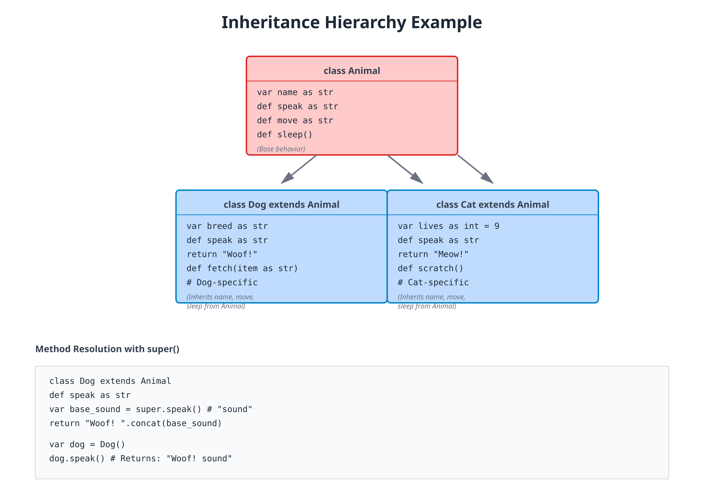

# 09: Inheritance and Mixins

**Audience:** All  
**Time:** 120 minutes  
**Prerequisites:** 07-Classes, 08-Interfaces  
**You'll learn:** Extend classes, override methods, super calls, mixins, hierarchies

---

## The Big Picture

**Inheritance** lets classes extend other classes, sharing code and building hierarchies. Instead of duplicating code, parent classes provide common functionality that children specialize.

```
Animal (parent)
├── Dog (specializes in dogs)
├── Cat (specializes in cats)
└── Bird (specializes in birds)
```

---

## Basic Inheritance



### Extending a Class

```zebra
// file: 09_inheritance_basic.zbr
// teaches: class inheritance
// chapter: 09-Inheritance-and-Mixins

class Animal
    var name as str = ""
    var age as int = 0
    
    def greet
        print "I'm ${name}, ${age} years old"

class Dog
    inherits Animal
        def bark
            print "${name} says: Woof!"

class Cat
    inherits Animal
        def meow
            print "${name} says: Meow!"

class Main
    shared
        def main
            var dog = Dog()
            dog.name = "Buddy"
            dog.age = 3
            dog.greet()      // I'm Buddy, 3 years old
            dog.bark()       // Buddy says: Woof!
            
            var cat = Cat()
            cat.name = "Whiskers"
            cat.age = 2
            cat.greet()      // I'm Whiskers, 2 years old
            cat.meow()       // Whiskers says: Meow!
```

**Key points:**
- `inherits Animal` — Dog extends Animal
- Inherits fields (`name`, `age`) and methods (`greet`)
- Can add new methods (`bark`, `meow`)

### Method Overriding

```zebra
// file: 09_override.zbr
// teaches: overriding parent methods
// chapter: 09-Inheritance-and-Mixins

class Animal
    def speak as str
        return "Some sound"

class Dog
    inherits Animal
        def speak as str  // Override parent method
            return "Woof!"

class Cat
    inherits Animal
        def speak as str  // Different implementation
            return "Meow!"

class Main
    shared
        def main
            var dog = Dog()
            print dog.speak()  // Woof!
            
            var cat = Cat()
            print cat.speak()  // Meow!
```

### Super Calls (Calling Parent Methods)

```zebra
// file: 09_super.zbr
// teaches: calling parent implementation
// chapter: 09-Inheritance-and-Mixins

class Vehicle
    var speed as int = 0
    
    def accelerate
        speed = speed + 10
        print "Accelerating to ${speed} mph"

class Car
    inherits Vehicle
        def accelerate  // Override but call parent
            # First call parent implementation
            super.accelerate()
            # Then add custom behavior
            print "Car is now cruising smoothly"

class Main
    shared
        def main
            var car = Car()
            car.accelerate()
            // Accelerating to 10 mph
            // Car is now cruising smoothly
```

---

## Hierarchies

### Multi-Level Inheritance

```zebra
// file: 09_hierarchy.zbr
// teaches: inheritance hierarchies
// chapter: 09-Inheritance-and-Mixins

class Animal
    var name as str = ""
    def sound as str
        return "?"

class Mammal
    inherits Animal
        def warm_blooded as bool
            return true

class Dog
    inherits Mammal
        def sound as str
            return "Woof!"

class Main
    shared
        def main
            var dog = Dog()
            dog.name = "Buddy"
            print dog.name             // Buddy
            print dog.sound()          // Woof!
            print dog.warm_blooded()   // true
```

### Treating as Parent Type

```zebra
// file: 09_polymorphic_hierarchy.zbr
// teaches: treating children as parents
// chapter: 09-Inheritance-and-Mixins

class AnimalShelter
    var animals as List(Animal) = List()
    
    def add_animal(animal as Animal)
        animals.add(animal)
    
    def announce_arrivals
        for animal in animals
            print "We have ${animal.name}"
            print "It says: ${animal.sound()}"

class Main
    shared
        def main
            var shelter = AnimalShelter()
            
            var dog = Dog()
            dog.name = "Rex"
            shelter.add_animal(dog)
            
            var cat = Cat()
            cat.name = "Mittens"
            shelter.add_animal(cat)
            
            shelter.announce_arrivals()
```

---

## Mixins

**Mixins** let you compose behavior from multiple sources without deep inheritance chains.

```zebra
// file: 09_mixins.zbr
// teaches: mixin composition
// chapter: 09-Inheritance-and-Mixins

class Swimmer
    def swim
        print "Swimming!"

class Runner
    def run
        print "Running!"

class Duck
    inherits Swimmer
        var name as str = ""
        
        def quack
            print "${name} quacks!"

class Dog
    inherits Swimmer
        var name as str = ""
        def bark
            print "${name} barks!"

class Athlete
    inherits Runner
        var name as str = ""
        def compete
            run()
            print "${name} is competing!"

class Main
    shared
        def main
            var duck = Duck()
            duck.name = "Donald"
            duck.swim()        // Swimming!
            duck.quack()       // Donald quacks!
            
            var dog = Dog()
            dog.name = "Buddy"
            dog.swim()         // Swimming!
            dog.bark()         // Buddy barks!
            
            var athlete = Athlete()
            athlete.name = "Alice"
            athlete.compete()  // Running! Alice is competing!
```

---

## Real World: Document Hierarchy

```zebra
// file: 09_document_hierarchy.zbr
// teaches: realistic inheritance use
// chapter: 09-Inheritance-and-Mixins

class Document
    var title as str = ""
    var content as str = ""
    var created_at as str = ""
    
    def preview as str
        var lines = content.split("\n")
        if lines.count() > 3
            return lines.at(0).concat("\n").concat(lines.at(1)).concat("\n").concat(lines.at(2))
        return content

class BlogPost
    inherits Document
        var author as str = ""
        var tags as List(str) = List()
        
        def get_summary as str
            return "Posted by ${author}: ${preview()}"

class Report
    inherits Document
        var department as str = ""
        var sections as List(str) = List()
        
        def is_complete as bool
            return sections.count() > 0

class Main
    shared
        def main
            var post = BlogPost()
            post.title = "Learning Zebra"
            post.content = "Zebra is awesome\nLine 2\nLine 3\nLine 4"
            post.author = "Alice"
            post.tags.add("programming")
            print post.get_summary()
            
            var report = Report()
            report.title = "Q1 Report"
            report.department = "Engineering"
            report.sections.add("Achievements")
            report.sections.add("Challenges")
            print "Report complete: ${report.is_complete()}"
```

---

## Common Patterns

### Template Method Pattern

```zebra
class DataProcessor
    def process(data as str)
        var cleaned = clean(data)
        var transformed = transform(cleaned)
        var validated = validate(transformed)
        return validated
    
    def clean(data as str) as str
        return data.trim()
    
    def transform(data as str) as str
        return data.upper()
    
    def validate(data as str) as bool
        return data.len > 0

class CustomProcessor
    inherits DataProcessor
        def transform(data as str) as str
            return data.lower()  // Override just this step
```

### Factory Pattern

```zebra
class AnimalFactory
    shared
        def create(kind as str) as Animal
            if kind == "dog"
                return Dog()
            elif kind == "cat"
                return Cat()
            else
                return Animal()
```

---

## If you're new to programming

> **Inheritance** is like saying "Dog is a type of Animal." Dogs have everything animals have, plus their own special abilities.
>
> **Override** means giving your own version of a method. Even though Animal has a `speak` method, Dog can have its own version that says "Woof!"
>
> **Super** is saying "run the parent's version first, then my custom version."

---

## Common Mistakes

> ❌ **Mistake:** Forgetting to call super
>
> ```zebra
> class Car
>     inherits Vehicle
>         def accelerate
>             print "Car accelerating"  // ❌ Forgot super.accelerate()
> ```
>
> ✅ **Better:**
> ```zebra
> class Car
>     inherits Vehicle
>         def accelerate
>             super.accelerate()       // ✅ Call parent first
>             print "Car accelerating"
> ```

> ❌ **Mistake:** Deep inheritance chains
>
> ```zebra
> class A; inherits B
> class B; inherits C
> class C; inherits D
> class D; inherits E    # ❌ Too deep, hard to understand
> ```
>
> ✅ **Better:** Keep hierarchies shallow (2-3 levels max), use composition/mixins for complex behavior

> ❌ **Mistake:** Overriding with wrong signature
>
> ```zebra
> class Animal
>     def speak as str
>
> class Dog
>     inherits Animal
>         def speak(volume as int) as str  # ❌ Wrong signature
> ```
>
> ✅ **Better:**
> ```zebra
> class Dog
>     inherits Animal
>         def speak as str  # ✅ Same signature
>             return "Woof!"
> ```

---

## Exercises

### Exercise 1: Vehicle Hierarchy

Create a vehicle hierarchy with cars, motorcycles, and trucks:

<details>
<summary>Solution</summary>

```zebra
class Vehicle
    var brand as str = ""
    var year as int = 0
    
    def start_engine
        print "Starting engine"
    
    def info as str
        return "${year} ${brand}"

class Car
    inherits Vehicle
        var doors as int = 4
        
        def start_engine
            super.start_engine()
            print "Car engine started"

class Motorcycle
    inherits Vehicle
        def start_engine
            super.start_engine()
            print "Motorcycle engine roared to life"

class Main
    shared
        def main
            var car = Car()
            car.brand = "Toyota"
            car.year = 2023
            print car.info()        // 2023 Toyota
            car.start_engine()      // Starting engine / Car engine started
            
            var bike = Motorcycle()
            bike.brand = "Harley"
            bike.year = 2022
            bike.start_engine()     // Starting engine / Motorcycle engine roared to life
```

</details>

### Exercise 2: Employee Hierarchy

Create an employee hierarchy (Employee → Manager → Director):

<details>
<summary>Solution</summary>

```zebra
class Employee
    var name as str = ""
    var salary as float = 0.0
    
    def get_info as str
        return "${name}: ${salary}"

class Manager
    inherits Employee
        var team_size as int = 0
        
        def get_info as str
            return super.get_info().concat(" (Managing ${team_size} people)")

class Director
    inherits Manager
        var budget as float = 0.0
        
        def get_info as str
            return super.get_info().concat(" (Budget: ${budget})")

class Main
    shared
        def main
            var emp = Employee()
            emp.name = "Alice"
            emp.salary = 50000.0
            print emp.get_info()
            
            var mgr = Manager()
            mgr.name = "Bob"
            mgr.salary = 70000.0
            mgr.team_size = 5
            print mgr.get_info()
            
            var dir = Director()
            dir.name = "Carol"
            dir.salary = 100000.0
            dir.team_size = 20
            dir.budget = 1000000.0
            print dir.get_info()
```

</details>

### Exercise 3: Shape Hierarchy

Extend the shape interface from Chapter 08 with inheritance:

<details>
<summary>Solution</summary>

```zebra
interface Shape
    def area as float
    def perimeter as float

class BaseShape
    implements Shape
        def area as float
            return 0.0
        def perimeter as float
            return 0.0

class Circle
    inherits BaseShape
        var radius as float = 0.0
        
        def area as float
            return 3.14 * radius * radius
        
        def perimeter as float
            return 2.0 * 3.14 * radius

class Rectangle
    inherits BaseShape
        var width as float = 0.0
        var height as float = 0.0
        
        def area as float
            return width * height
        
        def perimeter as float
            return 2.0 * (width + height)

class Main
    shared
        def main
            var shapes as List(Shape) = List()
            
            var circle = Circle()
            circle.radius = 5.0
            shapes.add(circle)
            
            var rect = Rectangle()
            rect.width = 10.0
            rect.height = 5.0
            shapes.add(rect)
            
            for shape in shapes
                print "Area: ${shape.area()}"
```

</details>

---

## Next Steps

- → **10-Properties** — Getters, setters, computed values
- → **14-Contracts** — Enforce invariants across hierarchies
- 🏋️ **Project-1-CLI-Tool** — Use hierarchies for options/commands

---

## Key Takeaways

- **Inheritance creates hierarchies** — Specialize parent classes
- **Override methods** to customize behavior in child classes
- **Super calls** let you extend parent functionality
- **Keep hierarchies shallow** — 2-3 levels is healthy
- **Treat as parent type** for polymorphism
- **Mixins compose** behavior without deep chains

---

**Next:** Head to **10-Properties** to control field access with getters and setters.
