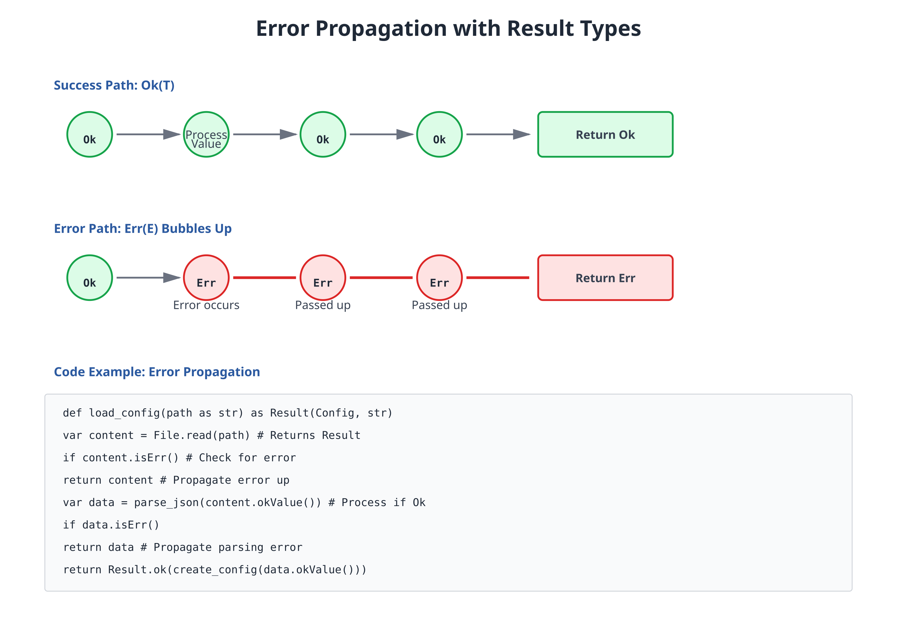

# 12: Error Handling with Results

**Audience:** All  
**Time:** 120 minutes  
**Prerequisites:** 02-Values, 11-Nil-Tracking  
**You'll learn:** Result type, Ok/Err pattern, error propagation, error chains

---

## The Big Picture

Instead of exceptions that crash, Zebra uses **Result types** that make errors explicit:

```
Result(T, E) = Ok(T) | Err(E)
```

Either you have a value of type T, or an error of type E.

---

## Basic Results

```zebra
// file: 12_result_basic.zbr
// teaches: result type
// chapter: 12-Error-Handling-with-Results

class Validator
    shared
        def parse_int(text as str) as Result(int, str)
            if text.len == 0
                return Result.err("Empty string")
            # Simplified: real parsing more complex
            var value as int = 42
            return Result.ok(value)

class Main
    shared
        def main
            var result = Validator.parse_int("123")
            
            if result.isOk()
                var value = result.okValue()
                print "Parsed: ${value}"
            elif result.isErr()
                var error = result.errValue()
                print "Error: ${error}"
```

---

## Unwrap Safely

```zebra
// file: 12_result_unwrap.zbr
// teaches: result unwrapping
// chapter: 12-Error-Handling-with-Results

class Main
    shared
        def main
            var result = Validator.parse_int("42")
            
            # Option 1: Check and use
            if result.isOk()
                var val = result.okValue()
                print val
            
            # Option 2: Get with default
            var val = result.unwrapOr(0)
            print val
            
            # Option 3: Unwrap (crashes if error)
            # var val = result.unwrap()
```

---

## Error Propagation



```zebra
// file: 12_error_propagation.zbr
// teaches: propagating errors
// chapter: 12-Error-Handling-with-Results

class Parser
    shared
        def parse_config(text as str) as Result(str, str)
            # Parse JSON/config
            if text.len == 0
                return Result.err("Empty config")
            return Result.ok("parsed")

class System
    shared
        def load_system(config_text as str) as Result(str, str)
            var parsed = Parser.parse_config(config_text)
            if parsed.isErr()
                return Result.err(parsed.errValue())
            
            var data = parsed.okValue()
            # Continue processing
            return Result.ok("System loaded")

class Main
    shared
        def main
            var system = System.load_system("")
            if system.isErr()
                print "Failed: ${system.errValue()}"
            else
                print system.okValue()
```

---

## Real World: API Client

```zebra
// file: 12_api_client.zbr
// teaches: results in realistic code
// chapter: 12-Error-Handling-with-Results

class APIClient
    shared
        def fetch_user(user_id as int) as Result(str, str)
            if user_id <= 0
                return Result.err("Invalid user ID")
            # Simulate API call
            if user_id == 1
                return Result.ok("Alice")
            return Result.err("User not found")
        
        def fetch_and_greet(user_id as int) as Result(str, str)
            var user_result = fetch_user(user_id)
            if user_result.isErr()
                return Result.err(user_result.errValue())
            
            var user = user_result.okValue()
            var greeting = "Hello, ${user}!"
            return Result.ok(greeting)

class Main
    shared
        def main
            var result = APIClient.fetch_and_greet(1)
            print result.unwrapOr("Error: Could not greet")
```

---

## Exercises

### Exercise 1: Safe String to Int

<details>
<summary>Solution</summary>

```zebra
class Parser
    shared
        def string_to_int(text as str) as Result(int, str)
            if text.len == 0
                return Result.err("Empty string")
            # Real impl would parse digits
            if text == "abc"
                return Result.err("Not a number")
            return Result.ok(42)

class Main
    shared
        def main
            var r1 = Parser.string_to_int("42")
            var r2 = Parser.string_to_int("abc")
            print r1.unwrapOr(0)
            print r2.unwrapOr(0)
```

</details>

---

## Next Steps

- → **13-Generics** — Type-safe containers
- → **15-Pipelines** — Chain operations gracefully

---

## Key Takeaways

- **Result(T, E)** — Either value or error
- **Check before unwrapping** — Use isOk(), isErr()
- **Propagate errors** — Pass them up the call stack
- **unwrapOr()** — Safe default fallback
- **Errors are values** — Not exceptions

---

**Next:** Head to **13-Generics** for type-safe abstractions.
