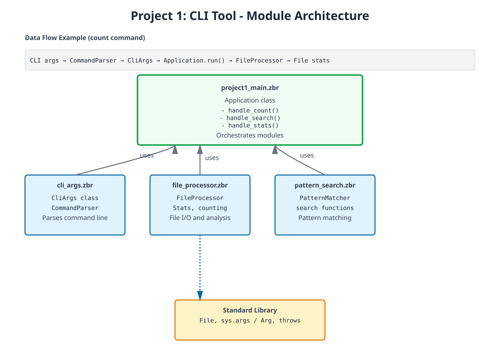

# Project 1: Command-Line Text Processing Tool

**Time:** 3-4 hours  
**Prereq:** 01-12  
**Build:** A file processor that counts words, finds patterns, and analyzes text

---

## Project Overview

Create a CLI tool that:
- Reads files from command line arguments
- Counts lines, words, characters (like Unix `wc` command)
- Searches for patterns (like grep-lite functionality)
- Outputs statistics
- Handles multiple files
- Reports errors gracefully

**Learning Outcomes:**
- Command-line argument parsing and validation
- File I/O with proper error handling
- Collections (List/HashMap) for data aggregation
- Algorithms for text analysis
- Error handling with `throws`, `?` and `catch`
- Code organization in reusable modules
- Testing strategies for CLI tools

**Difficulty:** Intermediate | **Skills Required:** 1-12 chapters | **Team Size:** Solo



---

## Step 1: Command-Line Argument Parsing

First, create a module to handle CLI arguments:

```zebra
# file: cli_args.zbr
# teaches: argument parsing
# project: Project-1-CLI-Tool

class CliArgs
    var command: str
    var filename: str
    var pattern: str?

    cue init(command: str, filename: str)
        this.command = command
        this.filename = filename
        pattern = nil

class CommandParser
    static
        def parse(args: List(str)): CliArgs throws
            # Precondition: program name + command + filename
            if args.count() < 3
                raise "Usage: textool [command] [file]"

            var command = args.at(1)
            var filename = args.at(2)

            # Validate command
            if not valid_command(command)
                raise "Unknown command: ${command}"

            # Create args object
            var cli_args = CliArgs(command, filename)

            # Add pattern if provided
            if args.count() >= 4
                cli_args.pattern = args.at(3)

            return cli_args

        def valid_command(cmd: str): bool
            return cmd == "count" or cmd == "search" or cmd == "stats"
```

---

## Step 2: File Reading and Basic Counting

Build the core file I/O and counting functionality. Every operation that can fail is marked `throws`; a caller writes `?` after the call to pass the error up, so `count_lines` needs no error-handling code of its own:

```zebra
# file: file_processor.zbr
# teaches: file I/O and text processing
# project: Project-1-CLI-Tool

class Stats
    var filename: str
    var lines: int
    var words: int
    var chars: int

    cue init(filename: str, lines: int, words: int, chars: int)
        this.filename = filename
        this.lines = lines
        this.words = words
        this.chars = chars

    def display(): str
        return "${lines} lines, ${words} words, ${chars} chars: ${filename}"

class FileProcessor
    static
        def read_file(filename: str): str throws
            # Check if file exists first
            if not File.exists(filename)
                raise "File not found: ${filename}"

            # Read the entire file
            var content = File.read(filename)

            if content.len == 0
                raise "File is empty: ${filename}"

            return content

        def count_lines(filename: str): int throws
            var content = read_file(filename)?
            var lines = content.split("\n")

            # Count non-empty lines (common behavior)
            var count = 0
            for line in lines
                if line.trim().len > 0
                    count = count + 1

            return count

        def count_words(filename: str): int throws
            var content = read_file(filename)?
            var words = content.split(" ")

            var count = 0
            for word in words
                if word.trim().len > 0
                    count = count + 1

            return count

        def count_chars(filename: str): int throws
            var content = read_file(filename)?
            return content.len

        def get_stats(filename: str): Stats throws
            var content = read_file(filename)?

            var lines = content.split("\n")
            var line_count = lines.count()
            var word_count = 0
            var char_count = content.len

            for line in lines
                var words = line.split(" ")
                for word in words
                    if word.len > 0
                        word_count = word_count + 1

            return Stats(filename, line_count, word_count, char_count)
```

---

## Step 3: Pattern Matching

Add grep-like pattern search functionality. `use file_processor exposing FileProcessor` brings the class from Step 2 into scope by name:

```zebra
# file: pattern_search.zbr
# teaches: pattern matching and filtering
# project: Project-1-CLI-Tool

use file_processor exposing FileProcessor, Stats

class PatternMatcher
    static
        def search_lines(filename: str, pattern: str): List(str) throws
            var content = FileProcessor.read_file(filename)?
            var lines = content.split("\n")

            var matches = List(str)()
            var line_num = 0

            for line in lines
                line_num = line_num + 1
                if line.contains(pattern)
                    # Format: "line_number: content"
                    matches.add("${line_num}: ${line}")

            if matches.count() == 0
                raise "No matches found for pattern: ${pattern}"

            return matches

        def search_with_context(filename: str, pattern: str, context_lines: int): List(str) throws
            var content = FileProcessor.read_file(filename)?
            var lines = content.split("\n")

            var results = List(str)()
            var line_num = 0

            for line in lines
                line_num = line_num + 1
                if line.contains(pattern)
                    # Add context lines before
                    var start = line_num - context_lines - 1
                    if start < 0
                        start = 0

                    var i = start
                    while i < line_num - 1
                        results.add(lines.at(i))
                        i = i + 1

                    # Add the matching line (with marker)
                    results.add("> ${line_num}: ${line}")

                    # Add context lines after
                    var end = line_num + context_lines
                    if end > lines.count()
                        end = lines.count()

                    i = line_num
                    while i < end
                        results.add(lines.at(i))
                        i = i + 1

            return results
```

---

## Step 4: Main Application Logic

Tie everything together in the main entry point. `main` is where errors stop: its method-level `catch` clause (after the body, at the same indent as `def`) turns any error raised anywhere below into one printed line. Note `if args.pattern as pattern` — the optional is unwrapped and bound in one step:

```zebra
# file: project1_main.zbr
# teaches: orchestrating modules
# project: Project-1-CLI-Tool

use cli_args exposing CliArgs, CommandParser
use file_processor exposing FileProcessor
use pattern_search exposing PatternMatcher

class Application
    var args: CliArgs

    cue init(parsed_args: CliArgs)
        args = parsed_args

    def run(): bool throws
        if args.command == "count"
            return handle_count()?
        else if args.command == "search"
            return handle_search()?
        else if args.command == "stats"
            return handle_stats()?

        raise "Unknown command: ${args.command}"

    def handle_count(): bool throws
        var lines = FileProcessor.count_lines(args.filename)?
        var words = FileProcessor.count_words(args.filename)?
        var chars = FileProcessor.count_chars(args.filename)?

        print("${lines} lines")
        print("${words} words")
        print("${chars} chars")

        return true

    def handle_search(): bool throws
        if args.pattern as pattern
            var matches = PatternMatcher.search_lines(args.filename, pattern)?
            print("Found ${matches.count()} matches:")

            for match in matches
                print(match)

            return true

        raise "Search requires a pattern"

    def handle_stats(): bool throws
        var stats = FileProcessor.get_stats(args.filename)?
        print(stats.display())
        return true

def main()
    var parsed = CommandParser.parse(sys.args())?
    var app = Application(parsed)
    app.run()?
catch |e|
    print("Error: ${e.message}")
```

---

## Part 2: Adding Features

A `throws` method composes other `throws` methods with `?`; the first failure ends the method and hands the error to the caller. At the top, an inline postfix `catch` supplies a fallback value instead of propagating:

```zebra
use file_processor exposing FileProcessor

class FileAnalyzer
    static
        def analyze(filename: str): str throws
            var lines = FileProcessor.count_lines(filename)?
            var words = FileProcessor.count_words(filename)?
            return "Lines: ${lines}, Words: ${words}"

def main()
    print(FileAnalyzer.analyze("test.txt") catch "could not analyze test.txt")
```

---

## Part 3: Full Implementation

Add these features:
- Read command-line arguments
- Support multiple files
- Pattern matching (grep-like)
- Output formatting
- Error handling

**Expected functionality:**
```bash
# Word count
tool -c file.txt          # Count lines
tool -w file.txt          # Count words
tool -l file.txt          # Get line length

# Search
tool -s "pattern" file.txt  # Search lines matching pattern

# Multiple files
tool -c file1.txt file2.txt # Count lines in multiple files
```

---

## Testing Your Project

Create a test file to verify your implementation:

```bash
# Create sample file
echo "The quick brown fox" > sample.txt
echo "jumps over the lazy dog" >> sample.txt

# Test commands (with compile-and-run, the program's own arguments go after `--`)
zebra project1_main.zbr -- count sample.txt         # Count lines, words, chars
zebra project1_main.zbr -- search sample.txt quick  # Find pattern
zebra project1_main.zbr -- stats sample.txt         # Show statistics
zebra project1_main.zbr -- search sample.txt zzz    # Error: No matches found for pattern: zzz
```

---

## Exercises & Extensions

### Exercise 1: Add Line Numbering Output

Modify the search function to always show line numbers with output:

```zebra
def search_with_numbers(filename: str, pattern: str): List(str) throws
    # Results already carry line numbers from PatternMatcher; `?` passes
    # any error straight through to our caller
    return PatternMatcher.search_lines(filename, pattern)?
```

### Exercise 2: Find Longest Line

Add a new `longest` command that finds and displays the longest line:

```zebra
class FileProcessor
    static
        def find_longest_line(filename: str): str throws
            var content = read_file(filename)?
            var lines = content.split("\n")
            var longest = ""
            var max_len = 0

            for line in lines
                if line.len > max_len
                    max_len = line.len
                    longest = line

            return "Longest (${max_len} chars): ${longest}"
```

### Exercise 3: Statistics Summary

Extend stats to show min/max/average line length:

```zebra
class Stats
    var filename: str
    var lines: int
    var words: int
    var chars: int
    var min_line_len: int
    var max_line_len: int
    var avg_line_len: float
    
    def display(): str
        var summary = "${lines} lines, ${words} words, ${chars} chars\n"
        return summary + "Line lengths: min=${min_line_len}, max=${max_line_len}, avg=${avg_line_len}"
```

### Exercise 4: Case-Insensitive Search

Add support for a `-i` flag to search case-insensitively:

```zebra
class PatternMatcher
    static
        def search_case_insensitive(filename: str, pattern: str): List(str) throws
            var content = FileProcessor.read_file(filename)?
            var lines = content.split("\n")
            var pattern_lower = pattern.lower()

            var matches = List(str)()
            var line_num = 0

            for line in lines
                line_num = line_num + 1
                if line.lower().contains(pattern_lower)
                    matches.add("${line_num}: ${line}")

            return matches
```

### Challenge: Support Multiple Files

Modify the application to process multiple files at once. A file that cannot be read should be skipped rather than abort the whole run — `catch nil` turns the error into an optional, and `if ... as` keeps only the successes:

```zebra
class Application
    var files: List(str)

    def aggregate_stats(filenames: List(str)): str
        var total_lines = 0
        var total_words = 0
        var total_chars = 0

        for filename in filenames
            var s = FileProcessor.get_stats(filename) catch nil
            if s as stats
                total_lines = total_lines + stats.lines
                total_words = total_words + stats.words
                total_chars = total_chars + stats.chars

        return "Total: ${total_lines} lines, ${total_words} words, ${total_chars} chars"
```

---

## Key Concepts Reinforced

- **File I/O** — Reading files with error handling
- **Collections** — Using List to accumulate results
- **Control flow** — Iterating and filtering text
- **Nil handling** — Optional pattern argument
- **Error handling** — `throws` methods, `?` propagation, `catch` at the boundary
- **Classes** — Organizing functionality into modules
- **Strings** — Splitting, searching, formatting
- **Optionals** — `catch nil` and `if ... as` to skip failures without aborting

---

## Architecture Decisions

**Module Organization:**
- `cli_args.zbr` — Argument parsing (thin responsibility)
- `file_processor.zbr` — Core file I/O (stable, well-tested)
- `pattern_search.zbr` — Search logic (isolated from I/O)
- `project1_main.zbr` — Orchestration and CLI (thin coordinator)

**Why this structure?** Each module has a clear, testable responsibility. You can test file reading separately from pattern matching, and both separately from CLI handling.

**Error Handling Strategy:** Every I/O operation is `throws`, and every caller writes `?`. Errors bubble up naturally—if file reading fails, search fails; if search fails, `main`'s `catch` clause reports it. No hidden failures, and no error-checking code anywhere except the one place errors are actually handled.

---

**Expected code size:** 300-400 lines total with all exercises

---

## What You've Built

✅ Real-world program structure with modules  
✅ Complete file and stream processing  
✅ Command-line interface with argument parsing  
✅ Robust error handling with `throws`, `?` and `catch`  
✅ Pattern matching and text analysis  
✅ Extensible design for new features  

---

## Performance Notes

For large files (>10MB), consider:
1. Reading line-by-line instead of entire file into memory
2. Early exit from search (stop after first N matches)
3. Streaming pattern matching instead of loading whole file

Example streaming read:

```zebra
# Read and process line-by-line instead of all at once
def count_lines_streaming(filename: str): int throws
    # (Pseudocode - requires file iteration API)
    var count = 0
    # for line in File.read_lines(filename)
    #     count = count + 1
    return count
```

---

**Next:** Project 2 adds networking and concurrency concepts to build an HTTP server.
