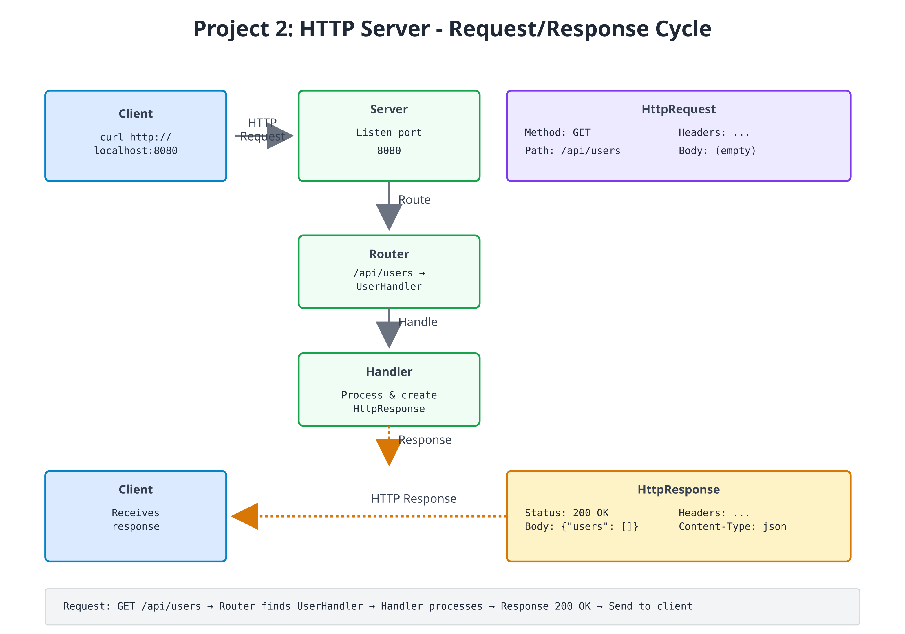
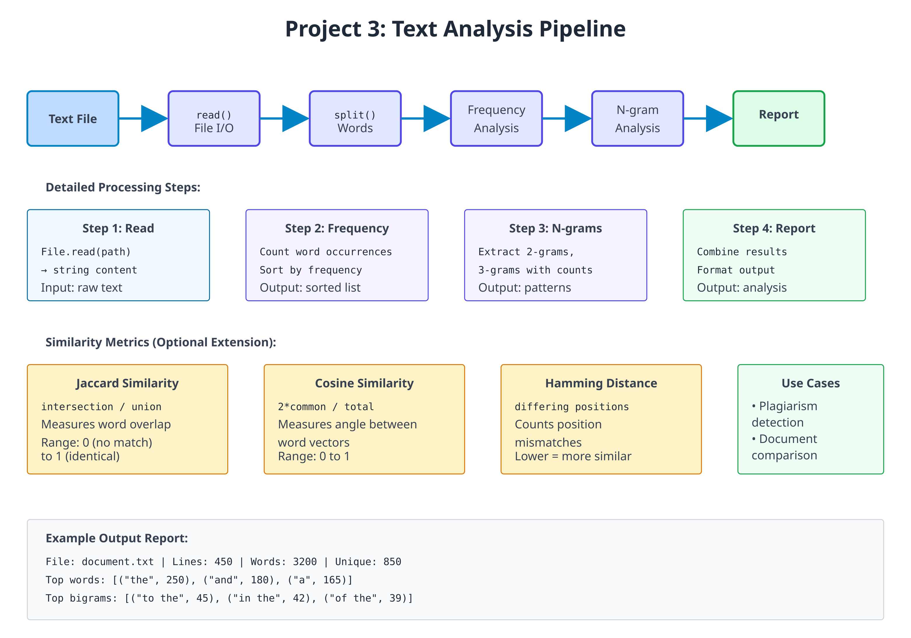

# Projects 2 & 3: HTTP Server and Data Analysis

## Project 2: HTTP Server (16-18 hours)

**Build:** A small REST API server that answers real HTTP requests with JSON

**Learning Outcomes:**
- Serving HTTP with the built-in `Http.serve`
- Routing on method and path, including a path parameter
- Producing and parsing JSON with `Json`
- Choosing status codes (200, 201, 400, 404, 405)
- Module-level state shared by a server's handlers
- What "one thread per connection" means for that state



Zebra's standard library already knows how to speak HTTP. `Http.serve(port, handler)`
listens on a port, parses each request into an `HttpRequest` (`method`, `path`,
`content`, and the raw `query` string), calls your handler, and writes the
`HttpResponse` it returns back to the client. Your job is the part that is actually
about your application: the data, and deciding which response each request gets.

The project is three files in one directory:

| File | Role |
|---|---|
| `user_store.zbr` | The data: a `User` class and the list of users |
| `router.zbr` | `route(req)` — turns one request into one response |
| `http_server.zbr` | `main()` — starts the server |

---

### Step 1: The Data Model

```zebra
# file: user_store.zbr
# teaches: module-level state, a small data model, JSON output
# project: Project-2-HTTP-Server

class User
    var id: int
    var name: str

    cue init(id: int, name: str)
        this.id = id
        this.name = name

    def toJson(): str
        var obj = Json.object()
        obj.putInt("id", this.id)
        obj.put("name", this.name)
        return Json.stringify(obj)

# One list shared by every function in this file (QUICKSTART §2.1).
var users = List(User)()
var next_id = 1

def addUser(name: str): User
    var user = User(next_id, name)
    users.add(user)
    next_id = next_id + 1
    return user

def findUser(id: int): User?
    for user in users
        if user.id == id
            return user
    return nil

def allUsersJson(): str
    var parts = List(str)()
    for user in users
        parts.add(user.toJson())
    return "[" + parts.join(",") + "]"
```

`users` and `next_id` are **module-level** variables: one value shared by every
function in the file, so a user added by one request is visible to the next.
`Json.object()` builds the JSON text for us, so a name containing a quote is
escaped correctly without any hand-written string gymnastics.

---

### Step 2: Request Routing

The router is a single function from `HttpRequest` to `HttpResponse`. The
built-in `HttpResponse` has factories for the common cases — `HttpResponse.ok(body)`
and `HttpResponse.notFound(body)` — and `HttpResponse.new(status, body)` for any
other status code.

```zebra
# file: router.zbr
# teaches: routing on method and path, path parameters, status codes
# project: Project-2-HTTP-Server

use user_store exposing addUser, findUser, allUsersJson

def route(req: HttpRequest): HttpResponse
    if req.path == "/health"
        return HttpResponse.ok("{\"status\": \"healthy\"}")

    if req.path == "/api/users"
        if req.method == "GET"
            return HttpResponse.ok(allUsersJson())
        if req.method == "POST"
            return createUser(req.content)
        return HttpResponse.new(405, "method not allowed")

    # /api/users/<id> -- a path parameter
    if req.path.startsWith("/api/users/") and req.method == "GET"
        # "/api/users/2".split("/") is ["", "api", "users", "2"].
        # Keep the ": str" -- without it, today's compiler mistypes the element.
        var idText: str = req.path.split("/").at(3)
        if findUser(idText.toInt()) as user
            return HttpResponse.ok(user.toJson())
        return HttpResponse.notFound("no user ${idText}")

    return HttpResponse.notFound("no route for ${req.method} ${req.path}")

def createUser(body: str): HttpResponse
    # Expect a JSON body like {"name": "Ada"}
    if Json.parse(body) as json
        var name = json.getStr("name")
        if name.len > 0
            return HttpResponse.new(201, addUser(name).toJson())
    return HttpResponse.new(400, "expected a JSON body like {\"name\": \"Ada\"}")
```

Every route is an `if` you can read top to bottom. Adding a route is adding a
branch; there is no registration table to keep in sync.

---

### Step 3: Starting the Server

```zebra
# file: http_server.zbr
# teaches: starting a real server with Http.serve
# project: Project-2-HTTP-Server

use router exposing route

def main()
    print("Listening on http://localhost:8080  (Ctrl+C to stop)")
    Http.serve(8080, route)
```

`Http.serve` takes the port and the handler function, and never returns: it
accepts connections until you stop the process.

> **Concurrency note.** `Http.serve` handles each connection on its own thread, so
> requests can run at the same time. The `users` list has no lock around it, so
> two simultaneous `POST`s could race. That is fine for trying the server out
> with one client at a time, as below; a production server would need to guard
> shared state.

---

### Exercises

1. **Add query parameter parsing:** `req.query` holds the raw text after `?` (e.g. `name=Ada&limit=5`); split it into key/value pairs and support `GET /api/users?name=Ada`
2. **Complete the resource:** add `PUT /api/users/<id>` (rename) and `DELETE /api/users/<id>`, returning 404 for an unknown id
3. **Request logging:** log each request (timestamp, method, path, response code)
4. **Middleware:** wrap `route` in a function that runs code before and after every request
5. **Validation:** reject names that are empty after `.trim()` or longer than 50 characters with a 400
6. **Guard the shared state:** make concurrent `POST`s safe (see Chapter 14c)

### Testing the Server

Run the three files from the same directory. The first build takes a little
while; then the server prints its banner and waits:

```bash
$ zebra http_server.zbr
Listening on http://localhost:8080  (Ctrl+C to stop)
```

From a second terminal:

```bash
$ curl http://localhost:8080/health
{"status": "healthy"}

$ curl http://localhost:8080/api/users
[]

$ curl -X POST -d '{"name": "Ada"}' http://localhost:8080/api/users
{"id":1,"name":"Ada"}

$ curl -X POST -d '{"name": "Grace"}' http://localhost:8080/api/users
{"id":2,"name":"Grace"}

$ curl http://localhost:8080/api/users
[{"id":1,"name":"Ada"},{"id":2,"name":"Grace"}]

$ curl http://localhost:8080/api/users/2
{"id":2,"name":"Grace"}

$ curl -i http://localhost:8080/api/users/9
HTTP/1.1 404 Not Found
...
no user 9

$ curl -i -X DELETE http://localhost:8080/api/users
HTTP/1.1 405 Method Not Allowed
...
method not allowed
```

Use `curl -i` to see the status line and headers. (The runtime labels every
response `Content-Type: text/html; charset=utf-8`, even when the body is JSON.)

Stop the server with Ctrl+C.

---

## Project 3: Text Data Analysis (12-15 hours)

**Build:** Analyze text data (n-grams, frequencies, similarity) for linguistic patterns

**Learning Outcomes:**
- Advanced data structures (HashMap, nested structures)
- Algorithms (n-gram extraction, frequency analysis, similarity scoring)
- File batch processing
- Statistical analysis
- Performance optimization with data structures



---

### Step 1: Frequency Analysis

Start with counting word frequencies:

```zebra
# file: frequency_analysis.zbr
# teaches: frequency counting and sorting
# project: Project-3-Data-Analysis

class WordFrequency
    var word: str
    var count: int
    
    cue init(word: str, count: int)
        this.word = word
        this.count = count
    
    def to_string(): str
        return "${word}: ${count}"

class FrequencyAnalyzer
    static
        def analyze_text(text: str): List(WordFrequency)
            var words = text.lower().split(" ")
            var freq: HashMap(str, int) = HashMap()
            
            # Count occurrences
            for word in words
                var cleaned = word.trim()
                if cleaned.len > 0
                    if freq.contains(cleaned)
                        freq.put(cleaned, freq.fetch(cleaned) + 1)
                    else
                        freq.put(cleaned, 1)
            
            # Convert to list and sort by frequency
            var results: List(WordFrequency) = List()
            for word, count in freq
                var wf = WordFrequency(word, count)
                results.add(wf)
            
            # Simple bubble sort (in-place)
            var i = 0
            while i < results.count()
                var j = 0
                while j < results.count() - 1
                    var current = results.at(j)
                    var next = results.at(j + 1)
                    if current.count < next.count
                        # Swap (simplified)
                        var temp = current
                        results[j] = next
                        results[j + 1] = temp
                    j = j + 1
                i = i + 1
            
            return results
        
        def top_words(text: str, limit: int): List(WordFrequency)
            var all_freqs = analyze_text(text)
            var results: List(WordFrequency) = List()
            
            var i = 0
            while i < limit and i < all_freqs.count()
                results.add(all_freqs.at(i))
                i = i + 1
            
            return results
```

---

### Step 2: N-gram Extraction

Extract contiguous sequences of N words:

```zebra
# file: ngram_analysis.zbr
# teaches: n-gram extraction and pattern detection
# project: Project-3-Data-Analysis

class NGram
    var gram: str
    var count: int
    var positions: List(int)  # Track where it appears
    
    cue init(gram: str)
        this.gram = gram
        count = 1
        positions = List()

class NGramAnalyzer
    static
        def extract_ngrams(text: str, n: int): HashMap(str, NGram)
            var words = text.lower().split(" ")
            var ngrams: HashMap(str, NGram) = HashMap()
            
            var i = 0
            while i < words.count() - (n - 1)
                var gram = ""
                var j = 0
                while j < n
                    var word = words.at(i + j).trim()
                    if j > 0
                        gram = gram.concat(" ")
                    gram = gram.concat(word)
                    j = j + 1
                
                if ngrams.contains(gram)
                    var ng = ngrams.fetch(gram)
                    ng.count = ng.count + 1
                    ng.positions.add(i)
                else
                    var ng = NGram(gram)
                    ng.positions.add(i)
                    ngrams.put(gram, ng)
                
                i = i + 1
            
            return ngrams
        
        def top_ngrams(text: str, n: int, limit: int): List(NGram)
            var all_grams = extract_ngrams(text, n)
            var results: List(NGram) = List()
            
            # Simple sorting
            for gram, ng in all_grams
                results.add(ng)
            
            # Bubble sort by count
            var i = 0
            while i < results.count()
                var j = 0
                while j < results.count() - 1
                    var current = results.at(j)
                    var next = results.at(j + 1)
                    if current.count < next.count
                        var temp = current
                        results[j] = next
                        results[j + 1] = temp
                    j = j + 1
                i = i + 1
            
            # Return top N
            var top: List(NGram) = List()
            i = 0
            while i < limit and i < results.count()
                top.add(results.at(i))
                i = i + 1
            
            return top
```

---

### Step 3: Similarity Analysis

Compare texts using Jaccard and other similarity metrics:

```zebra
# file: similarity_analysis.zbr
# teaches: similarity metrics and comparison
# project: Project-3-Data-Analysis

class SimilarityMetrics
    static
        def jaccard_similarity(text1: str, text2: str): float
            var words1 = text1.lower().split(" ")
            var words2 = text2.lower().split(" ")
            
            # Find intersection
            var intersection = 0
            for word1 in words1
                for word2 in words2
                    if word1 == word2
                        intersection = intersection + 1
                        break
            
            # Size of the union (crude approximation)
            var total = words1.count() + words2.count() - intersection
            
            if total == 0
                return 0.0
            
            return intersection.toFloat() / total.toFloat()
        
        def cosine_similarity(text1: str, text2: str): float
            # Simplified cosine similarity (not true cosine, but similar)
            var words1 = text1.lower().split(" ")
            var words2 = text2.lower().split(" ")
            
            var common = 0
            for word1 in words1
                for word2 in words2
                    if word1 == word2
                        common = common + 1
            
            var len1 = words1.count()
            var len2 = words2.count()
            
            if len1 == 0 or len2 == 0
                return 0.0
            
            var denominator = len1 + len2
            return (2.0 * common.toFloat()) / denominator.toFloat()
        
        def hamming_distance(text1: str, text2: str): int
            var words1 = text1.lower().split(" ")
            var words2 = text2.lower().split(" ")
            
            var max_len = words1.count()
            if words2.count() > max_len
                max_len = words2.count()
            
            var distance = 0
            var i = 0
            while i < max_len
                var w1 = if(i < words1.count(), words1.at(i), "")
                var w2 = if(i < words2.count(), words2.at(i), "")
                
                if w1 != w2
                    distance = distance + 1
                
                i = i + 1
            
            return distance
```

---

### Step 4: Main Analysis Application

Tie together all analysis tools:

```zebra
# file: analysis_main.zbr
# teaches: combining analysis modules
# project: Project-3-Data-Analysis

use frequency_analysis exposing WordFrequency, FrequencyAnalyzer
use ngram_analysis exposing NGram, NGramAnalyzer

class TextAnalysisReport
    var source_file: str = ""
    var word_count: int = 0
    var unique_words: int = 0
    var top_words: List(WordFrequency) = List(WordFrequency)()
    var bigrams: List(NGram) = List(NGram)()
    var trigrams: List(NGram) = List(NGram)()

class AnalysisApplication
    static
        def analyze_file(filename: str): TextAnalysisReport throws
            # File.read is not `throws` -- a missing file stops the program --
            # so check first and raise an error the caller can catch.
            if not File.exists(filename)
                raise "File not found: ${filename}"

            var content = File.read(filename)
            if content.len == 0
                raise "File is empty: ${filename}"

            var words = content.split(" ")
            var unique_words_set: HashMap(str, int) = HashMap()

            for word in words
                var cleaned = word.lower().trim()
                if cleaned.len > 0
                    unique_words_set.put(cleaned, 1)

            var report = TextAnalysisReport()
            report.source_file = filename
            report.word_count = words.count()
            report.unique_words = unique_words_set.count()
            report.top_words = FrequencyAnalyzer.top_words(content, 10)
            report.bigrams = NGramAnalyzer.top_ngrams(content, 2, 5)
            report.trigrams = NGramAnalyzer.top_ngrams(content, 3, 5)

            return report

        def print_report(report: TextAnalysisReport)
            print("==== Text Analysis Report ====")
            print("File: ${report.source_file}")
            print("Total words: ${report.word_count}")
            print("Unique words: ${report.unique_words}")
            print("")

            print("Top 10 Words:")
            for wf in report.top_words
                print("  ${wf.to_string()}")
            print("")

            print("Top 5 Bigrams:")
            for bigram in report.bigrams
                print("  ${bigram.gram} (${bigram.count})")
            print("")

            print("Top 5 Trigrams:")
            for trigram in report.trigrams
                print("  ${trigram.gram} (${trigram.count})")

def main()
    var report = AnalysisApplication.analyze_file("sample.txt")
    AnalysisApplication.print_report(report)
catch |err|
    print("Error: ${err.message}")
```

---

### Exercises

1. **Find most common bigrams and trigrams** — Already implemented in Step 2
2. **Detect language patterns** — Compare bigram distributions across texts
3. **Compare two documents** — Use similarity metrics from Step 3
4. **Find suspicious passages** — Identify sections with high similarity to other documents (plagiarism detection)
5. **Build a frequency graph** — Output word frequency distribution
6. **Implement TF-IDF** — Weight words by frequency and document uniqueness

### Testing

Put the four files in one directory with a `sample.txt` next to them, then:

```bash
$ zebra analysis_main.zbr
==== Text Analysis Report ====
File: sample.txt
Total words: 15
Unique words: 11

Top 10 Words:
  the: 3
  quick: 2
  fox: 2
...
```

(That is the report for a `sample.txt` containing *the quick brown fox jumps
over the lazy dog and the quick red fox runs*. Words with equal counts may come
out in a different order.) Without a `sample.txt` the program prints
`Error: File not found: sample.txt`.

Exercise 3 is where a `compare_files.zbr` comes from: write it yourself, using
`SimilarityMetrics` from Step 3.

---

## Project Comparison Summary

| Feature | Project 1 | Project 2 | Project 3 |
|---------|-----------|-----------|-----------|
| **Focus** | File I/O + CLI | Networking + Routing | Algorithms + Data Structures |
| **Core Skill** | Argument parsing, basic text processing | Network protocols, request handling | Complex algorithms, statistics |
| **Complexity** | Beginner-Intermediate | Intermediate | Intermediate-Advanced |
| **Code Size** | 300-400 lines | 400-600 lines | 350-500 lines |
| **Key Learning** | Modules, error handling | Servers, routing, state management | Data structures, sorting, metrics |
| **Time Estimate** | 3-4 hours | 5-7 hours | 4-5 hours |
| **Real-World Use** | Log analysis, text processing | API servers, web services | Data science, plagiarism detection |

---

## Capstone Challenge: Integrated System

After completing all three projects, combine them:

```zebra
class IntegratedSystem
    static
        def run_analysis_via_http(port: int, analysis_dir: str)
            # Start HTTP server (Project 2)
            # Serve text analysis results (Project 3)
            # Process files via CLI (Project 1)
            
            # GET /health — Health check
            # POST /analyze — Upload and analyze file
            # GET /results — Retrieve analysis results
            # GET /compare — Compare two documents
```

This demonstrates:
- ✅ Networking and servers
- ✅ Complex data processing
- ✅ CLI integration
- ✅ Professional system design

---

**Each project is a portfolio piece. Together, they demonstrate mastery of Zebra and modern programming fundamentals.**

---

## Project Comparison

| Feature | CLI Tool | HTTP Server | Data Analysis |
|---------|----------|-------------|----------------|
| Lines of code | 200-300 | 300-500 | 250-400 |
| Main focus | File I/O | Networking | Algorithms |
| Difficulty | Beginner | Intermediate | Intermediate |
| Key learning | CLI, modules | Servers, protocols | Data structures |
| Time to complete | 3-4 hours | 5-7 hours | 4-5 hours |

---

## Progressive Difficulty

1. **CLI Tool:** Learn file I/O and basic structure
2. **HTTP Server:** Add networking and concurrency concepts
3. **Data Analysis:** Deep dive into algorithms and data structures

Each project reuses concepts from previous ones while introducing new challenges.

---

## Capstone Challenges

After completing all three:
1. Integrate CLI tool with HTTP server (serve file statistics)
2. Use data analysis in HTTP endpoints
3. Build a combined system processing files via HTTP

---

## Expected Outcomes

✅ Real-world program architecture  
✅ Network programming fundamentals  
✅ Advanced data structure manipulation  
✅ Practical error handling  
✅ Performance considerations  
✅ Testing strategies  

---

**Each project is a portfolio piece demonstrating Zebra mastery.**
