# 18b: Building GUI Applications

**Audience:** All — anyone who wants a window instead of a terminal
**Time:** 120 minutes
**Prerequisites:** 05-Control-Flow, 07-Classes-and-Instances, 07b-Structs-Unions-and-Value-Types
**You'll learn:** The MVU (Model-View-Update) architecture, `Gui.run`, dispatching messages with `g.send`, laying out widgets with `using g.vbox`/`g.hbox`, the widget catalogue, forms, the native tree, drawing on a canvas, the embedded code editor, and how to test a GUI without ever opening a window

> **Version note:** this chapter tracks Zebra **0.9.0-rc3 or newer**. Trees,
> toolbars, `g.scope`, window-wide hotkeys (`g.hotkey`) and the `g.area` canvas all
> landed after 0.9.0-rc2 and are not in the rc1 or rc2 releases. A compiler built
> from the main branch after rc2 has them too, even though its `zebra --version`
> may still say rc2.

---

## The Big Picture

Zebra's GUI is built on **MVU** — Model, View, Update — the architecture
popularised by Elm. There is no widget tree for you to mutate, no callbacks
firing at unpredictable times, and no `onClick` handler reaching into global
state. There are three functions and one rule:

| Function | Signature | Job |
|---|---|---|
| `init` | `(): Model` | Build the starting state. Called once. |
| `update` | `(Model, Msg): Model` | Given a state and something that happened, produce the next state. |
| `view` | `(Gui, Model)` | Draw the current state. Never changes it. |

The rule: **`view` may not modify the model.** When the user does something,
`view` *sends a message*; `update` is the only place state changes. That single
constraint is what makes a GUI reasonable to think about — every possible state
transition is a `branch` arm in one function you can read top to bottom.

If you have written a GUI before, the thing to unlearn is the callback. You will
not write "when this button is clicked, do X." You will write "when this button
is clicked, *say that it was clicked*," and separately, "when someone says the
button was clicked, the new state is X."

Zebra runs the loop for you:

```
init() ──▶ model ──▶ view(g, model) ──▶ user clicks ──▶ g.send(Msg.foo)
                ▲                                              │
                └────────── update(model, Msg.foo) ◀───────────┘
```

---

## Your First Window

Here is a complete, working program. Save it as `counter.zbr`:

```zebra
# file: counter.zbr
# teaches: MVU, Gui.run, g.send, hbox layout
# chapter: 18b-GUI-Applications

struct Counter
    var count: int

union Msg
    inc
    dec
    reset

def init(): Counter
    return Counter(count: 0)

def update(m: Counter, msg: Msg): Counter
    branch msg
        on Msg.inc    return Counter(count: m.count + 1)
        on Msg.dec    return Counter(count: m.count - 1)
        on Msg.reset  return Counter(count: 0)

def view(g: Gui, m: Counter)
    g.text("Count: " + m.count.toString())
    g.separator()
    using g.hbox("##buttons", false)
        g.button("+", Msg.inc)
        g.button("-", Msg.dec)
        g.button("Reset", Msg.reset)

def main()
    Gui.run("Counter", 300, 160, init, update, view)
```

Run it with native OS controls:

```bash
zebra --gui-backend=libui_ng counter.zbr
```

A real window appears, with real Win32 / GTK3 / Cocoa buttons. Click `+` and the
label updates.

### What each piece is doing

- **`struct Counter`** is the Model. It holds *everything* the program knows.
  If it isn't in the model, `view` can't draw it.
- **`union Msg`** enumerates everything that can *happen*. Three variants, three
  things a user can do. This union is the complete vocabulary of your program's
  events — which is why reading it tells you what the program does.
- **`update`** takes the old state and a message and returns the new state. It
  never touches the screen.
- **`view`** takes the state and draws it. It never changes the state; each
  widget carries the message it sends when the user acts on it (`g.button("+",
  Msg.inc)`), and `g.send(...)` reports anything else.
- **`Gui.run`** wires them together and owns the event loop.

Notice that `update` returns a **new** `Counter` rather than modifying the old
one. That's the immutable-update idiom from Chapter 07b, and it is the natural
fit here: each message produces the next state, so the history of your program is
a chain of values rather than a pile of mutations.

---

## Running It: Two Backends and a Stub

The same source runs against several backends. You choose at the command line —
the program does not change:

```bash
zebra --gui-backend=libui_ng counter.zbr   # native OS controls (recommended)
zebra --gui-backend=tui      counter.zbr   # terminal UI, no GPU, no dependencies
zebra counter.zbr                          # stub backend — see below
```

The compiler scaffolds a `zig build` project next to your source
(`counter_gui_libui_ng/`) and builds it. The first build fetches and compiles the
GUI library, so it takes a while; subsequent runs are fast.

### The stub backend is your test harness

Run a GUI program with no `--gui-backend` flag at all and you get the **stub**
backend: it runs exactly one frame, prints every widget it would have drawn to
stderr, and exits.

```
$ zebra counter.zbr
[gui] text: Count: 0
[gui] ---
[gui] button: +
[gui] button: -
[gui] button: Reset
```

This is more useful than it looks. It means a GUI program is *testable in CI* —
no display, no window manager, no clicking. You can assert on the widget tree the
way you would assert on any other output. It is also the fastest way to check
that a layout change did what you meant before waiting on a full native build.

> **Note:** the stub never fires an event, so a single stub frame
> shows you the initial view. To exercise `update`, call it directly from a test
> (see *Testing Your Update Function* below) — not by sending a message
> unconditionally from `view`, which is a livelock (see *Common Mistakes*).

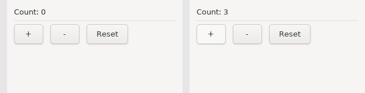

---

## Messages That Carry Data

Not everything is a bare event. When the user types, the message needs to carry
what they typed. Union variants can hold a payload:

```zebra
# file: greeter.zbr
# teaches: payload messages, g.field, mixed unions
# chapter: 18b-GUI-Applications

struct Model
    var name: str
    var greeting: str

union Msg
    name_changed: str
    greet
    clear

def init(): Model
    return Model(name: "", greeting: "")

def update(m: Model, msg: Msg): Model
    branch msg
        on Msg.name_changed as newName
            return Model(name: newName, greeting: m.greeting)
        on Msg.greet
            if m.name.len == 0
                return Model(name: m.name, greeting: "Please type a name first.")
            return Model(name: m.name, greeting: "Hello, " + m.name + "!")
        on Msg.clear
            return Model(name: "", greeting: "")

def view(g: Gui, m: Model)
    g.text("What is your name?")
    g.field("##name", m.name, def(s: str): Msg = Msg.name_changed(s))
    using g.hbox("##row", false)
        g.button("Greet", Msg.greet)
        g.button("Clear", Msg.clear)
    g.separator()
    g.text(m.greeting)

def main()
    Gui.run("Greeter", 360, 200, init, update, view)
```

Two things to notice.

**A payload comes from the widget.** `g.field(id, text, on)` shows `text` and
calls `on` with whatever the user typed; `on` builds the message, here
`Msg.name_changed(s)` in call syntax. Receiving it uses a binding in the branch
arm: `on Msg.name_changed as newName`. This is exactly the union pattern from
Chapter 07b — the GUI adds no new concepts here.

**A `Msg` union may mix** payload and no-payload variants freely, as this one
does. `greet` and `clear` carry nothing; `name_changed` carries a `str`.

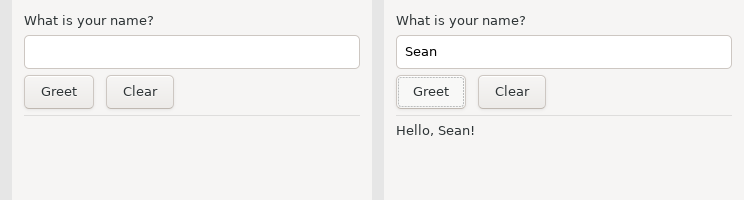

---

## Widgets That Carry Their Message

A button carries a message. A checkbox and a text entry carry a *function that
builds one*, because the message needs the new value:

| Widget | Shape | The `on` function |
|---|---|---|
| `g.button(label, msg)` | sends `msg` on click | — |
| `g.toggle(label, checked, on)` | shows `checked`; calls `on` when it flips | `def(b: bool): Msg` |
| `g.field(label, text, on)` | shows `text`; calls `on` on every change | `def(s: str): Msg` |

The model drives the widget: you pass the model's value in, and the widget
reports a change by sending the message `on` returns. `update` stores it; the
next render passes the stored value back in. Nothing is read out of a widget,
so `view` never learns about a change before `update` does.

```zebra
# file: widgets.zbr
# teaches: toggle, field, slider; the on function
# chapter: 18b-GUI-Applications

struct Model
    var loud: bool
    var volume: float
    var label: str

union Msg
    set_loud: bool
    set_volume: float
    set_label: str

def init(): Model
    return Model(loud: false, volume: 50.0, label: "untitled")

def update(m: Model, msg: Msg): Model
    branch msg
        on Msg.set_loud as v    return Model(loud: v, volume: m.volume, label: m.label)
        on Msg.set_volume as v  return Model(loud: m.loud, volume: v, label: m.label)
        on Msg.set_label as v   return Model(loud: m.loud, volume: m.volume, label: v)

def view(g: Gui, m: Model)
    g.toggle("Loud mode", m.loud, def(b: bool): Msg = Msg.set_loud(b))
    g.field("Label", m.label, def(s: str): Msg = Msg.set_label(s))
    g.slider("Volume", m.volume, 0.0, 100.0, def(v: float): Msg = Msg.set_volume(v))
    g.separator()
    g.text("volume=" + m.volume.toString() + " loud=" + m.loud.toString())

def main()
    Gui.run("Widgets", 380, 260, init, update, view)
```

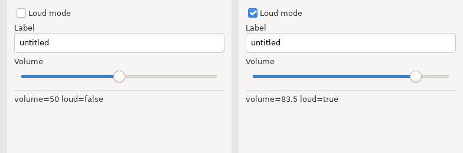

Every widget that holds state has this shape: the model supplies the value the
widget shows, and the `on` function names the message for a change. There is no
widget that *returns* a value — so `view` never compares anything, and `update`
is the only place the model changes. `g.inputMultiline(label, text, on)`,
`g.combobox(label, items, selected, on)` and `g.spinbox(label, value, min, max, on)`
follow the same rule with `def(s: str)`, `def(i: int)` and `def(n: int)`.

So do the entries that look different but are not. `g.password(label, text, on)`
and `g.search(label, text, on)` are `g.field` on a masked entry and a search-styled
one; same `def(s: str)`. `g.radio(label, items, selected, on)` is one radio button
per item with exactly one selected; it reports the chosen index with `def(i: int)`,
like a combobox, but the choices are in the open instead of behind a click.
`g.comboboxEditable(label, items, text, on)` is a drop-down the user can also type
into — a recent-files list with "or enter your own" — and because what comes back
is text, its `on` is `def(s: str)`, not an index.

---

## Layout

Widgets stack vertically by default. To place them side by side, put them in a
**horizontal box**. Boxes nest, and `using` scopes them:

```zebra
# file: layout.zbr
# teaches: using g.vbox / g.hbox, nesting, stretch
# chapter: 18b-GUI-Applications

struct Model
    var status: str

union Msg
    refresh

def init(): Model
    return Model(status: "ready")

def update(m: Model, msg: Msg): Model
    branch msg
        on Msg.refresh  return Model(status: "refreshed")

def view(g: Gui, m: Model)
    using g.vbox("##root", true)
        using g.hbox("##toolbar", false)
            g.button("Refresh", Msg.refresh)
            g.text("Status: " + m.status)
        g.separator()
        using g.hbox("##body", true)
            using g.vbox("##left", true)
                g.text("Left panel")
            using g.vbox("##right", true)
                g.text("Right panel")

def main()
    Gui.run("Layout", 480, 300, init, update, view)
```

That produces a toolbar row across the top and two panels side by side filling
the rest of the window.

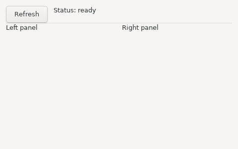

### The two arguments

`g.vbox(id, stretch)` and `g.hbox(id, stretch)` both take:

- **`id`** — a unique string identifying this box. The backend creates the box
  on the first frame and reuses it thereafter, so the id must be *stable* across
  frames. Prefix with `##` by convention: it marks the string as an identifier
  rather than a user-visible label.
- **`stretch`** — whether this box expands to fill the space available in its
  parent. A toolbar row is `false` (it should stay as short as its contents); a
  main content area is `true`.

### `using` versus `begin`/`end`

`using` is the recommended form because the box closes itself at the end of the
indented block — you cannot forget an `endVBox`. The explicit pair exists too:

```zebra
g.beginHBox("##row", false)
    g.button("Left", Msg.left)
    g.button("Right", Msg.right)
g.endHBox()
```

Both compile to the same thing. Prefer `using`.

> **Gotcha:** the `using` header and the first line of its body must be on
> adjacent lines — no blank line between them.

---

## The Widget Catalogue

| Call | Returns | Notes |
|---|---|---|
| `g.text(s)` | — | A label. Its text updates every frame. |
| `g.button(label, msg)` | — | Sends `msg` when clicked. |
| `g.toggle(label, checked, on)` | — | A checkbox; `on: def(b: bool): Msg` is called when it flips. |
| `g.field(label, text, on)` | — | Single-line text entry; `on: def(s: str): Msg` on every change. |
| `g.slider(label, value, min, max, on)` | — | `on: def(v: float): Msg` as it moves. Range is fixed at creation. |
| `g.inputMultiline(label, text, on)` | — | Multi-line entry; `on: def(s: str): Msg` on every change. |
| `g.combobox(label, items, sel, on)` / `g.spinbox(label, value, min, max, on)` | — | `on: def(i: int): Msg`. |
| `g.comboboxEditable(label, items, text, on)` | — | A drop-down that also takes typed text; `on: def(s: str): Msg` on a pick or a keystroke. |
| `g.radio(label, items, sel, on)` | — | One radio button per item; `on: def(i: int): Msg`. Pick-one-of-N in the open. |
| `g.password(label, text, on)` / `g.search(label, text, on)` | — | `field` on a masked / search-styled entry; `on: def(s: str): Msg`. |
| `g.menuItem(label, msg)` | — | A menubar item, inside `g.beginMenu(name)` … `g.endMenu()`. |
| `g.tool(label, msg)` / `g.toolIcon(label, icon, tip, msg)` | — | A toolbar item, inside `g.beginToolbar()` … `g.endToolbar()`; `g.toolSeparator()`, and `g.toolEnabled(bool)` for the next item. See *Toolbars* below. |
| `g.every(ms, msg)` | — | Sends `msg` every `ms` milliseconds while the view declares it. |
| `g.separator()` | — | A horizontal rule. |
| `g.send(msg)` | — | Dispatch a message to `update`. |
| `g.vbox(id, stretch)` / `g.hbox(id, stretch)` | — | Layout containers (with `using`). |
| `g.beginPanel(id)` / `g.endPanel(id)` | — | A titled group box. The `id` is the title; the end call must repeat it. This open/close pair is the only panel form. |
| `g.beginForm(id)` / `g.endForm(id)` | — | A settings-dialog layout: labels left, aligned; controls right. Each child's label is its row label. See *Forms* below. |
| `g.beginTable(id, cols)` … `g.endTable()` | `bool` | A list; `tableSetupColumn(name)` per column, `tableNextRow()` / `tableNextColumn()` + `g.text` per cell, `tableSetupCheckColumn(name, on)` + `tableCheck(checked)` for a checkbox column (`on: def(row: int, checked: bool): Msg`), `tableSetupEditColumn(name, on)` for an editable text column (`on(row, text)`; a declined edit snaps back on the next render), `tableSetupButtonColumn(name, on)` for a button per row (`on(row)`, cells are the labels); one of each per table. |
| `g.beginTree(id, onSelect, onActivate, onExpand)` … `g.endTree()` | — | The native tree; `treeNode(key, label, expanded)` … `treePop()` and `treeLeaf(key, label)` between them. See *Trees* below. |
| `g.tooltip(text)` | — | The hover text for the widget emitted just before it. See *Tooltips, Icons and the Clipboard* below. |
| `Gui.clipboardText()` / `Gui.setClipboardText(s)` | `str` / — | The system clipboard's text. Statics, called from `update`. |
| `g.area(id, w, h, draw, on)` | — | A canvas; `draw: def(c: Gui)` paints, `on: def(x: float, y: float, button: int): Msg` on a mouse press. See *Drawing* below. |

**Widget identity comes from the label.** A widget is matched to last render's
widget of the same kind and label, in order — so two buttons labelled `+` are
still two buttons. For a widget whose label you don't want displayed, use the
`##` prefix: `g.field("##filepath", m.path, on)`.

**A variant carries one payload.** The check column's `on` gets two values, a row
and a flag, and a union variant holds exactly one — so the message carries a small
struct: `struct Pick` with `row` and `checked`, and
`def(row: int, checked: bool): Msg = Msg.pick_row(Pick(row: row, checked: checked))`.
The tree's `onExpand` is the same shape; you will see it below.

### What is not there yet

Being honest about the edges, because discovering these by trial is unpleasant:

- **Trees are a single text column.** An icon from a built-in set, but no extra
  columns, no drag-and-drop, no in-place editing, and no keyboard on the TUI. A
  file browser that needs a size column is a table.
- **Icons are bytes, not files.** `folder`, `file`, `dot` and `warn` are painted by
  the runtime, and `Gui.registerIcon` takes your own RGBA pixels — but there is no
  image decoder yet, so a PNG is yours to decode. Buttons and table cells take no
  images at all.
- **Drawing has no images, gradients or transforms.** libui has them; they are
  not bound. (`g.canvas` covers the rest of the mouse and the keyboard — below.)
- **`g.sameLine()`, `g.spacing()`, `g.indent()`** are cosmetic no-ops on native
  backends — they belong to the immediate-mode style. Use an `hbox`.
- **`g.textColored`** renders the text but ignores the colour.
- **Fixed pixel widths** aren't supported; boxes divide space by `stretch`
  (`g.minSize(id, w, h)` gives a box a floor).

---

## Forms

A settings dialog is two columns: labels on the left, lined up, and the controls
on the right. `g.beginForm(id)` / `g.endForm(id)` lays its children out that way.
Nothing else about the view changes. Each widget's own label becomes its row label,
so `g.field("Host name", ...)` inside a form is a row called `Host name`.

```zebra
# file: settings_form.zbr
# teaches: g.beginForm / g.endForm, a widget's label as its row label, m except
# chapter: 18b-GUI-Applications

struct Model
    var host: str
    var port: int
    var tls: bool

union Msg
    set_host: str
    set_port: int
    set_tls: bool

def init(): Model
    return Model(host: "localhost", port: 8080, tls: true)

def update(m: Model, msg: Msg): Model
    branch msg
        on Msg.set_host as s  return m except host = s
        on Msg.set_port as n  return m except port = n
        on Msg.set_tls as b   return m except tls = b

def view(g: Gui, m: Model)
    g.beginForm("settings")
    g.field("Host name", m.host, def(s: str): Msg = Msg.set_host(s))
    g.spinbox("Port", m.port, 1, 65535, def(n: int): Msg = Msg.set_port(n))
    g.toggle("Use TLS", m.tls, def(b: bool): Msg = Msg.set_tls(b))
    g.endForm("settings")
    g.separator()
    g.text(if(m.tls, "https://", "http://") + m.host + ":" + m.port.toString())

def main()
    Gui.run("Settings", 380, 220, init, update, view)
```

On the stub:

```
[gui] form: settings
[gui] input: Host name = localhost
[gui] spinbox: Port val=8080 [1,65535]
[gui] checkbox: Use TLS = true
[gui] ---
[gui] text: https://localhost:8080
```

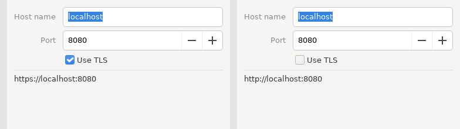

Three things to notice.

**The form is geometry, not behaviour.** The three widgets inside it are the
same `field`, `spinbox` and `toggle` from the catalogue, with the same `on`
functions. Take the `beginForm` / `endForm` lines out and the program still
works; it just stacks.

**`m except host = s`** is the struct-update idiom from Chapter 07b. `widgets.zbr`
rebuilt the whole `Model` in every arm; with three fields that was tolerable, with
ten it is not. `except` copies the model and changes one field.

**A row may be conditional.** Wrap a widget in `if m.advanced` and its row appears
and disappears with the flag. The backend inserts and removes the row; you do not
manage it.

On the TUI and the stub a form is a plain vertical box. Only the native backend
has the two-column layout, which is why the stub output above looks like any
other stack.

---

## Trees

Every desktop has one native tree: a single text column with expanders, a
selection, and a double-click. Windows' `SysTreeView32` has no columns at all, so
that is the subset Zebra binds — the same widget on Win32, GTK (`GtkTreeView`)
and Cocoa (`NSOutlineView`).

The view emits the whole tree on every render. Between `g.beginTree(...)` and
`g.endTree()`:

- `g.treeNode(key, label, expanded)` opens a node; the calls that follow are its
  children, until `g.treePop()`.
- `g.treeLeaf(key, label)` is a node with no children.

`key` is the app's stable name for the node — a path is the natural key. The
backend diffs by key from one render to the next, so the tree is not rebuilt
when a label changes.

The part to get right is expansion. **An expander click does not open the node.**
It sends `onExpand(key, open)`; `update` puts the key into (or out of) the model;
the next render passes `expanded: true` for that key, and *that* opens it. The
model owns what is open. So "Open all" is not a special tree operation — it is a
message like any other, and `update` sets the list.

`onExpand` gets two values, a key and a flag, and a variant carries one — so the
message carries a small struct, `Toggle`, exactly as the table's check column did.

```zebra
# file: file_tree.zbr
# teaches: g.beginTree / treeNode / treeLeaf / treePop / endTree, the model owns what is open
# chapter: 18b-GUI-Applications

struct Toggle
    var key: str
    var open: bool

struct Model
    var open: List(str)
    var selected: str

union Msg
    select: str
    expand: Toggle
    open_all
    close_all

def init(): Model
    var open: List(str) = ["src"]
    return Model(open: open, selected: "")

def isOpen(m: Model, key: str): bool
    for k in m.open
        if k == key
            return true
    return false

def update(m: Model, msg: Msg): Model
    branch msg
        on Msg.select as k
            return m except selected = k
        on Msg.expand as t
            var out: List(str) = []
            for k in m.open
                if k != t.key
                    out.add(k)
            if t.open
                out.add(t.key)
            return m except open = out
        on Msg.open_all
            var all: List(str) = ["src", "docs"]
            return m except open = all
        on Msg.close_all
            var none: List(str) = []
            return m except open = none

def view(g: Gui, m: Model)
    g.beginTree("files", def(k: str): Msg = Msg.select(k), def(k: str): Msg = Msg.select(k), def(k: str, o: bool): Msg = Msg.expand(Toggle(key: k, open: o)))
    g.treeNode("src", "src/", isOpen(m, "src"))
    g.treeLeaf("src/main.zbr", "main.zbr")
    g.treeLeaf("src/Parser.zbr", "Parser.zbr")
    g.treePop()
    g.treeNode("docs", "docs/", isOpen(m, "docs"))
    g.treeLeaf("docs/README.md", "README.md")
    g.treePop()
    g.treeLeaf("build.zbr", "build.zbr")
    g.endTree()
    g.text("selected: " + m.selected)
    using g.hbox("##buttons", false)
        g.button("Open all", Msg.open_all)
        g.button("Close all", Msg.close_all)

def main()
    Gui.run("Files", 320, 320, init, update, view)
```

On the stub:

```
[gui] beginTree: files
[gui] tree d=0 v src/ (src)
[gui] tree d=1 - main.zbr (src/main.zbr)
[gui] tree d=1 - Parser.zbr (src/Parser.zbr)
[gui] tree d=0 > docs/ (docs)
[gui] tree d=1 - README.md (docs/README.md)
[gui] tree d=0 - build.zbr (build.zbr)
[gui] text: selected: 
[gui] button: Open all
[gui] button: Close all
```

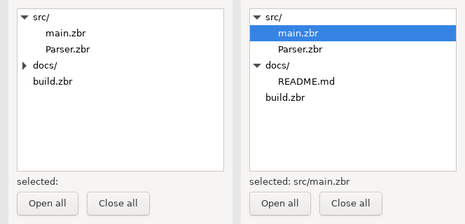

Read `v` as an open node, `>` as a closed one, `-` as a leaf, and `d=` as the
depth. `src` is open because `init` put it in the list; `docs` is closed. Nothing
in `view` decided that — `isOpen` only reads the model.

`g.beginTree` takes three functions after the id: `onSelect` and `onActivate`
are `def(key: str): Msg`, sent on selection and on double-click; `onExpand` is
`def(key: str, open: bool): Msg`. This program does not distinguish a double-click
from a click, so both build `Msg.select`.

The `treePop()` calls are the tree's structure: `src/` has two leaves and then
pops, `docs/` has one and pops, and `build.zbr` is at the root. Miss a pop and
everything after it becomes a child of the wrong node. The stub's `d=` column is
the quickest way to check.

---

## Drawing

`g.area(id, w, h, draw, on)` is a canvas: Direct2D on Windows, Cairo on GTK,
CoreGraphics on macOS. `draw` paints it; `on` is the message for a mouse press.

`draw` is different from every other function in this chapter: **the toolkit calls
it at paint time, not `view`.** By then `view` has returned and `m` is gone. So the
closure starts with a `capture` block that copies what it needs out of the model.
The runtime keeps those captured bytes and repaints only when they change — a
message that alters a captured value repaints the area, one that does not, does
not.

```zebra
# file: board.zbr
# teaches: g.area, a draw closure with capture, the mouse-press message
# chapter: 18b-GUI-Applications

struct Model
    var cells: List(bool)

union Msg
    press: int
    clear

def init(): Model
    var cells: List(bool) = [false, false, false, false, false, false, false, false, false]
    return Model(cells: cells)

def update(m: Model, msg: Msg): Model
    branch msg
        on Msg.press as cell
            var out: List(bool) = []
            var i = 0
            for c in m.cells
                out.add(if(i == cell, not c, c))
                i += 1
            return Model(cells: out)
        on Msg.clear
            return init()

def view(g: Gui, m: Model)
    g.area("board", 240, 240, def(c: Gui)
        capture
            var cells: List(bool) = m.cells
        var side = 240.0
        var k = 80.0
        c.fillRect(0.0, 0.0, side, side, 0xFAFAF0)
        c.line(k, 0.0, k, side, 0x333333, 2.0)
        c.line(k * 2.0, 0.0, k * 2.0, side, 0x333333, 2.0)
        c.line(0.0, k, side, k, 0x333333, 2.0)
        c.line(0.0, k * 2.0, side, k * 2.0, 0x333333, 2.0)
        var i = 0
        for filled in cells
            if filled
                var cx = (i % 3).toFloat() * k + k / 2.0
                var cy = (i / 3).toFloat() * k + k / 2.0
                c.fillCircle(cx, cy, 28.0, 0x2A6EBB)
            i += 1
    , def(x: float, y: float, button: int): Msg = if(button == 1, Msg.press((y / 80.0).toInt() * 3 + (x / 80.0).toInt()), Msg.clear))
    g.button("Clear", Msg.clear)

def main()
    Gui.run("Board", 300, 320, init, update, view)
```

A left click on a cell toggles it; any other button clears the board. On the stub
the draw closure runs once and prints its verbs:

```
[gui] area: board 240x240
[gui] fillRect (0,0) 240x240 #fafaf0
[gui] line (80,0)-(80,240) #333333 t=2.0
[gui] line (160,0)-(160,240) #333333 t=2.0
[gui] line (0,80)-(240,80) #333333 t=2.0
[gui] line (0,160)-(240,160) #333333 t=2.0
[gui] button: Clear
```

No circles, because every cell starts `false`.

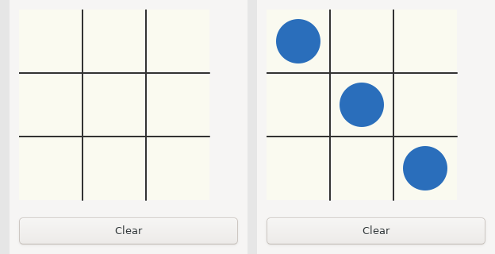

Some things to know:

- **The block-lambda shape.** A multi-line closure is `def(c: Gui)` on the call
  line, its body indented under it, and then `,` on a line of its own to start the
  next argument. The `capture` block comes first inside the body.
- **Coordinates are the area's own pixels**, origin top-left; `w` and `h` are a
  minimum size, and `c.canvasWidth()` / `c.canvasHeight()` tell you what you
  actually got.
- **Colours are `0xRRGGBB`**; a float is written with a point (`2.0`, not `2`).
- **The verbs:** `line(x1, y1, x2, y2, colour, thickness)`,
  `rect(x, y, w, h, colour, thickness)`, `fillRect(x, y, w, h, colour)`,
  `circle(cx, cy, r, colour, thickness)`, `fillCircle(cx, cy, r, colour)`,
  `drawText(x, y, s, colour, size)` with `size` 0 meaning the control font.
  Outside a draw closure they do nothing.
- **The press goes through `update` like everything else.** `on` turns a
  coordinate into a cell index and that into a message; `view` never looks at the
  mouse.

The TUI shows a placeholder where the area would be.

### The rest of the mouse, and the keyboard

`g.area` reports a press and nothing else. `g.canvas(id, w, h, draw, onMouse, onKey)`
is the same surface with the whole story: `onMouse(ev, x, y, b)` is called with `ev`
1 for a press, 2 for a release, 3 for a move (`b` is the buttons held, so a drag is a
move with `b != 0`), 4 when the pointer enters and 5 when it leaves; `onKey(vk, mods,
down)` gets keys once the canvas has focus (a click gives it), in the same vocabulary
as `g.hotkey` — letters as uppercase ASCII, arrows `0x25`–`0x28`. Every event is a
message, which is the point: a draggable dot is three arms of `update`.

```zebra
# file: canvas.zbr
# teaches: g.canvas, mouse move/release and keys as messages, a drag in update
# chapter: 18b-GUI-Applications

struct Model
    var x: float
    var y: float
    var dragging: bool

struct Ev
    var ev: int
    var x: float
    var y: float
    var b: int

struct Key
    var vk: int
    var mods: int
    var down: bool

union Msg
    mouse: Ev
    key: Key

def init(): Model
    return Model(x: 60.0, y: 60.0, dragging: false)

def update(m: Model, msg: Msg): Model
    branch msg
        on Msg.mouse as e
            var dx: float = e.x - m.x
            var dy: float = e.y - m.y
            if e.ev == 1 and dx * dx + dy * dy < 400.0
                return m except dragging = true
            if e.ev == 2
                return m except dragging = false
            if e.ev == 3 and m.dragging
                return m except x = e.x, y = e.y
            return m
        on Msg.key as k
            if not k.down
                return m
            if k.vk == 0x25
                return m except x = m.x - 10.0
            if k.vk == 0x27
                return m except x = m.x + 10.0
            return m

def view(g: Gui, m: Model)
    g.canvas("dot", 240, 160, def(c: Gui)
        capture
            var px: float = m.x
            var py: float = m.y
            var drag: bool = m.dragging
        c.fillRect(0.0, 0.0, c.canvasWidth(), c.canvasHeight(), 0xF4F4F4)
        c.fillCircle(px, py, 20.0, if(drag, 0xE05020, 0x2060C0))
    , def(ev: int, x: float, y: float, b: int): Msg = Msg.mouse(Ev(ev: ev, x: x, y: y, b: b)), def(vk: int, mods: int, down: bool): Msg = Msg.key(Key(vk: vk, mods: mods, down: down)))

def main()
    Gui.run("Canvas", 260, 220, init, update, view)
```

Two closures carry structs because a variant holds one payload (the same reason as
the check column above). Note that the colour while dragging is not set anywhere in
`view` — the draw closure captured `dragging`, so the press that flipped it also
repainted.

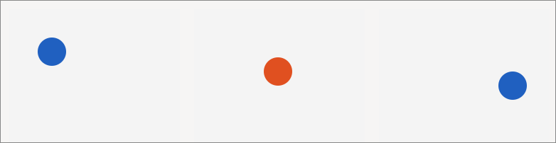

---

## Tooltips, Icons and the Clipboard

Three small things that separate a working app from a finished one.

`g.tooltip(text)` gives the widget emitted **just before it** a hover text. It is a
statement about the previous line, so it reads like a caption:

```zebra
g.button("Copy", Msg.copy)
g.tooltip("Copy the text above to the system clipboard")
```

The clipboard has no widget to hang on, so it is two statics on `Gui`, and they
belong in `update`, where the model changes:

```zebra
# file: clipboard.zbr
# teaches: g.tooltip, Gui.clipboardText / setClipboardText, treeNodeIcon / treeLeafIcon
# chapter: 18b-GUI-Applications

struct Model
    var text: str
    var pasted: str
    var picked: str

union Msg
    set_text: str
    copy
    paste
    pick: str

def init(): Model
    return Model(text: "hello from zebra", pasted: "", picked: "")

def update(m: Model, msg: Msg): Model
    branch msg
        on Msg.set_text as s
            return m except text = s
        on Msg.copy
            Gui.setClipboardText(m.text)
            return m
        on Msg.paste
            return m except pasted = Gui.clipboardText()
        on Msg.pick as k
            return m except picked = k

def view(g: Gui, m: Model)
    g.field("Text", m.text, def(s: str): Msg = Msg.set_text(s))
    g.tooltip("What Copy puts on the clipboard")
    using g.hbox("##row", false)
        g.button("Copy", Msg.copy)
        g.tooltip("Copy the text above to the system clipboard")
        g.button("Paste", Msg.paste)
        g.tooltip("Read the system clipboard into the line below")
    g.text("pasted: " + m.pasted)
    g.beginTree("files", def(k: str): Msg = Msg.pick(k), def(k: str): Msg = Msg.pick(k), def(k: str, o: bool): Msg = Msg.pick(if(o, k, k)))
    g.treeNodeIcon("src", "src/", true, "folder")
    g.treeLeafIcon("src/main.zbr", "main.zbr", "file")
    g.treeLeafIcon("src/todo", "unsaved", "warn")
    g.treePop()
    g.treeLeafIcon("build", "build", "dot")
    g.treeLeaf("plain", "no icon")
    g.endTree()
    g.tooltip("Icons come from the built-in set")
    g.text("picked: " + m.picked)

def main()
    Gui.run("Clipboard", 340, 360, init, update, view)
```

`Msg.copy` writes the model's text to the clipboard and returns the model
unchanged; `Msg.paste` reads the clipboard into the model, and `view` shows it. On
the stub both are a process-local string, so a copy followed by a paste prints what
was copied; on a desktop the round trip crosses the operating system's clipboard,
and what you paste may have come from another program.

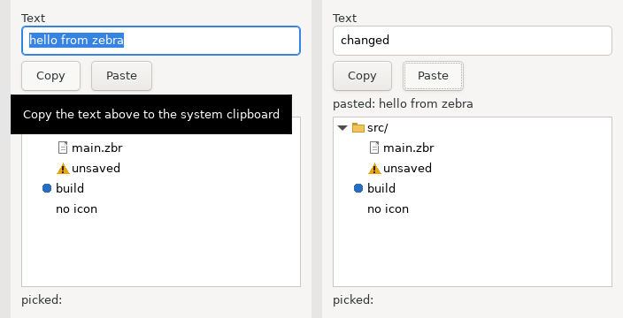

`treeNodeIcon` and `treeLeafIcon` are `treeNode` and `treeLeaf` with one more
argument, an icon name. Four are painted by the runtime (`folder`, `file`, `dot`,
`warn`), and the program can add its own: `Gui.registerIcon(name, w, h, rgba)` takes
straight-alpha RGBA bytes in a `str` — `w * h * 4` of them, which
`StringBuilder.appendChar(n)` assembles a byte at a time or a raw file supplies —
and the name then works wherever a built-in one does. Register in `main` before
`Gui.run` (registrations are queued until the toolkit is up) or from `update`. Any
unregistered name draws nothing. Zebra has no image decoder yet, so a PNG is the
program's to decode; when one exists, a path will slot in beside the bytes.

On the stub:

```
[gui] tooltip: What Copy puts on the clipboard
[gui] tree d=0 v src/ (src) [folder]
[gui] tree d=1 - main.zbr (src/main.zbr) [file]
```

The TUI ignores tooltips and icons; it has nowhere to hover and no cell to draw in.

---

## Toolbars

A menubar is fixed when the window is created, which is why the menus are declared
in every render and the first one wins. A toolbar is the other kind of strip: it
lives under the menubar (GTK and Windows) or in the title bar (macOS, where the
platform keeps them), its items carry icons, and it can *change* -- an item may be
enabled by the model, and the set itself may grow and shrink between renders. The
verbs mirror the menus with those two differences:

```zebra
# file: toolbar.zbr
# teaches: g.beginToolbar / tool / toolIcon / toolSeparator / toolEnabled, a toolbar that follows the model
# chapter: 18b-GUI-Applications

struct Model
    var running: bool
    var log: str
    var clicks: int

union Msg
    build
    run
    stop
    clear

def init(): Model
    return Model(running: false, log: "idle", clicks: 0)

def update(m: Model, msg: Msg): Model
    branch msg
        on Msg.build
            return m except log = "built", clicks = m.clicks + 1
        on Msg.run
            return m except running = true, log = "running", clicks = m.clicks + 1
        on Msg.stop
            return m except running = false, log = "stopped", clicks = m.clicks + 1
        on Msg.clear
            return m except log = "", clicks = 0

# a 12x12 filled square, straight-alpha RGBA
def square(r: int, g: int, b: int): str
    var sb = StringBuilder()
    var i: int = 0
    while i < 144
        sb.appendChar(r)
        sb.appendChar(g)
        sb.appendChar(b)
        sb.appendChar(255)
        i = i + 1
    return sb.build()

def view(g: Gui, m: Model)
    g.beginToolbar()
    g.toolIcon("Build", "hammer", "Compile the project", Msg.build)
    g.toolIcon("Run", "go", "Run the tests", Msg.run)
    g.toolEnabled(m.running)
    g.tool("Stop", Msg.stop)
    if m.clicks > 0
        g.toolSeparator()
        g.toolIcon("Clear", "warn", "Clear the log", Msg.clear)
    g.endToolbar()
    g.text("state: " + m.log)
    g.text("clicks: " + m.clicks.toString())

def main()
    Gui.registerIcon("hammer", 12, 12, square(0x60, 0x60, 0xC0))
    Gui.registerIcon("go", 12, 12, square(0x2E, 0xB8, 0x4E))
    Gui.run("toolbar", 420, 160, init, update, view)
```

`g.tool(label, msg)` is a button in the strip; `g.toolIcon(label, icon, tip, msg)`
adds an icon -- a built-in name or one from `Gui.registerIcon`, exactly as for the
tree -- and a tooltip. `g.toolEnabled(b)` applies to the **next** item and then
resets, so `g.toolEnabled(m.running)` followed by the Stop item is the whole of
"Stop is only clickable while something runs". A `g.toolSeparator()` is an item
too, which keeps the indices the runtime uses stable.

The strip is compared with the last render's: the same labels, icons and tooltips
in the same order means the runtime updates it in place (refreshing which message
each item sends, pushing any enabled change); anything else rebuilds it. So the
Clear item appearing after the first click costs one rebuild, and nothing in the
program has to know that.

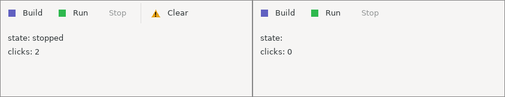

On the stub each item prints as `[gui] tool: Build [hammer]`; the TUI shows a row of
buttons.

---

## The Code Editor

Zebra ships a real code editor widget — the libui-ng backend embeds
**Scintilla**, the editing component behind Notepad++ and SciTE. This is what
makes it practical to write a development tool in Zebra.

```zebra
# file: editor.zbr
# teaches: CodeEditor, class Model, widget handles
# chapter: 18b-GUI-Applications

class Model
    var editor: CodeEditor? = nil
    var status: str = "ready"

union Msg
    save
    clear

def init(): Model
    var m = Model()
    m.editor = CodeEditor.forZebra()
    m.editor!.setText("def main()\n    print(\"hi\")\n")
    return m

def update(m: Model, msg: Msg): Model
    branch msg
        on Msg.save
            var text = m.editor!.getText()
            m.status = "saved " + text.len.toString() + " bytes"
        on Msg.clear
            m.editor!.setText("")
            m.status = "cleared"
    return m

def view(g: Gui, m: Model)
    using g.vbox("##root", true)
        using g.hbox("##bar", false)
            g.button("Save", Msg.save)
            g.button("Clear", Msg.clear)
            g.text(m.status)
        m.editor!.render(g, "##editor", 0, 0)

def main()
    Gui.run("Editor", 520, 360, init, update, view)
```

The editor's methods:

| Method | Purpose |
|---|---|
| `CodeEditor()` | A plain editor |
| `CodeEditor.forZebra()` | An editor preset for Zebra source |
| `.render(g, id, w, h)` | Create (first frame) and draw it; `w`/`h` are ignored — it fills its box |
| `.setText(s)` / `.getText()` | Replace / retrieve the content |
| `.setReadOnly(v)` | Make it a display pane rather than an editor |
| `.getCursorLine()` / `.getCursorCol()` | Caret position, 1-based |
| `.setCursorPosition(line, col)` | Jump to a location |

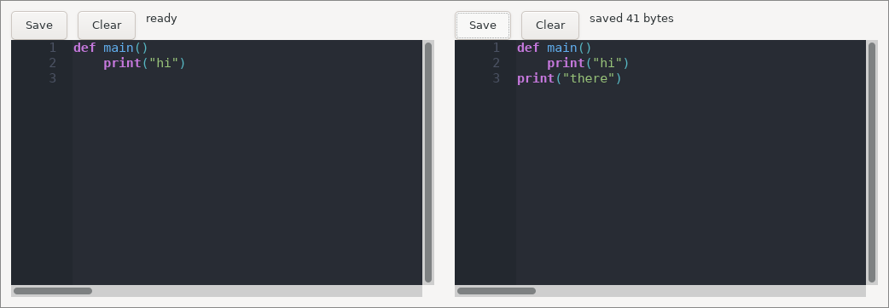

### Why this Model is a `class`

Every other example in this chapter used `struct Model`. This one uses `class`,
and the reason is worth understanding.

A `CodeEditor` is a **handle** to a live widget that owns a text buffer. It has
identity: there is one actual editor on screen, and the model needs to refer to
*that one*, not to a copy of it. Structs are value types — passing one to
`update` copies it — so a struct model would hand `update` a copy whose field
mutations are thrown away. A class is a reference type, so `m.editor!.setText("")`
in `update` reaches the editor the user is looking at.

The rule of thumb:

- **Pure data model** (numbers, strings, lists) → `struct`, and return a new one
  from `update`. Cleaner, and the immutability is genuinely useful.
- **Model owning widget handles or OS resources** → `class`, mutate in place,
  `return m`.

---

## Testing Your Update Function

`update` is a pure function from `(Model, Msg)` to `Model`. That means it is
ordinary code, and you can test it without a GUI at all:

```zebra
def test_inc()
    var m = init()
    var m2 = update(m, Msg.inc)
    assert m2.count == 1
    var m3 = update(m2, Msg.inc)
    assert m3.count == 2

def test_reset()
    var m = update(Counter(count: 41), Msg.reset)
    assert m.count == 0
```

Put the tests in the same file as `init` and `update` and run `zebra test
counter.zbr`: it runs every `def test_*()` function (the `test_` prefix is how it
finds them) and reports `2 passed, 0 failed`.

This is the practical payoff of the MVU constraint. In a callback-based GUI, the
logic that changes state is tangled into event handlers and can only be exercised
by driving the UI. Here, all of it lives in one pure function that takes a value
and returns a value.

For the `view` side, the stub backend gives you the widget tree as text, which
you can capture and assert on.

---

## Common Mistakes

> ❌ **Mistake:** Mutating the model in `view`
>
> ```zebra
> def view(g: Gui, m: Model)
>     m.count = m.count + 1         # ❌ view must not change state
>     g.text("Count: ${m.count}")
> ```
>
> ✅ **Fix:** Let a widget send a message and let `update` do it.
>
> ```zebra
> def view(g: Gui, m: Model)
>     g.button("Add", Msg.inc)      # ✅
>     g.text("Count: ${m.count}")
> ```
>
> With a `struct` model the compiler stops you outright — the parameter is not
> mutable. With a `class` model it will compile and *appear* to work, then
> desynchronise from `update` in ways that are miserable to debug. Treat the
> discipline as real even when the compiler doesn't enforce it.

> ❌ **Mistake:** Sending a message unconditionally from `view`
>
> ```zebra
> def view(g: Gui, m: Model)
>     g.send(Msg.tick)                   # ❌ every render queues a message …
>     g.text("ticks: ${m.ticks}")        #    … and a queued message causes a render
> ```
>
> ✅ **Fix:** A message comes from an event — a widget, or a subscription.
>
> ```zebra
> def view(g: Gui, m: Model)
>     g.every(1000, Msg.tick)            # ✅ once a second, while the view says so
>     g.text("ticks: ${m.ticks}")
> ```
>
> `view` runs after an event: a click, a change, a timer. An unconditional
> `g.send` in `view` is a livelock; the runtime drops it after a few passes with a
> warning. No widget returns a value, so there is nothing in `view` to compare;
> a `g.send` there is almost always a mistake.)

> ❌ **Mistake:** Reusing a widget id
>
> ```zebra
> g.field("Name", m.first, onFirst)   # ❌ both entries carry the id "Name"
> g.field("Name", m.last, onLast)
> ```
>
> ✅ **Fix:** Give each a unique id; hide the label with `##` if you don't want
> it shown.
>
> ```zebra
> g.field("##first", m.first, onFirst)
> g.field("##last", m.last, onLast)
> ```

> ❌ **Mistake:** Expecting `sameLine()` to work
>
> `g.sameLine()` is an immediate-mode idea and does nothing on native backends.
> Use `using g.hbox(...)`. The same goes for `g.spacing()` and `g.indent()`.

> ❌ **Mistake:** Expecting an expander click to open the node
>
> ```zebra
> g.treeNode("src", "src/", false)     # ❌ always closed: the click only sends onExpand
> ```
>
> ✅ **Fix:** Pass the model's answer. The click sends `onExpand(key, open)`,
> `update` records it, and the next render opens the node.
>
> ```zebra
> g.treeNode("src", "src/", isOpen(m, "src"))   # ✅
> ```
>
> The same rule as every other widget: the model drives it. A tree whose
> `expanded` is a constant never moves, however much you click.

---

## Real World: the Zebra IDE

The largest GUI program written in Zebra is the Zebra IDE
(`github.com/torial/zebra-ide`, `src/ide.zbr`): a lightweight IDE for Zebra, C and
Zig, written in this chapter's idiom and talking to `zebra lsp` and `zebra debug`.
It is worth reading once you have the basics, because it is every idea above at
full scale:

- A `class Model` holding a `BufferSet` of open documents -- each tab is a
  `CodeEditor` handle -- plus read-only editors for the Build, Tests and Debugger
  panes; the References, Symbols and Problems panes are tables.
- A `Msg` union of some forty-five variants: bare events (`save_file`, `build`),
  payload-carrying ones (`jump_ref: int`, `open_path: str`, `toggle_dir: str`),
  and `tick`.
- A menubar (`g.beginMenu`), a toolbar (`g.beginToolbar`) whose debug items follow
  the session and whose tail is the project's own tools from its manifest, a project
  explorer, tabs, a find bar of `field`s whose messages run the jump / open / find /
  rename, and the keyboard shortcuts claimed
  with `g.hotkey` so that Ctrl+S saves with the focus anywhere in the window --
  `view` pops the claimed chords with `g.takeKey()` and sends each as its message.
- Long-running work without blocking the loop: the compiler, the gates and the
  language server run as processes, and a `g.every(100, Msg.tick)` subscription
  delivers `Msg.tick`; `update` drains what has arrived into the model, and `view`
  shows it.


That last pattern is how you integrate long-running work into MVU: something
outside the loop produces, a subscription turns "time passed" into a message, and
`update` moves the result into the model.

---

## Exercises

### Exercise 1: A Temperature Converter

Build a window with one input for Celsius and a label showing Fahrenheit.

- Model: the Celsius text and the converted value.
- Msg: one payload variant carrying the new text.
- Use `.toFloat()` to parse, and handle the case where the text isn't a number.

*Hint: one `g.field` with an `on` function and one `g.text` is the whole of `view`.*

### Exercise 2: A Todo List

Model a list of tasks, each with a description and a done flag.

- Msg needs at least: `add: str`, `toggle: int`, `remove: int`.
- `view` draws an `hbox` per task: a checkbox and a "Delete" button.
- Every task's widgets need unique ids — derive them from the index, e.g.
  `"##done" + i.toString()`.

The number of tasks changes between renders, and each task creates widgets.
That is fine: the runtime inserts and removes widgets as the view changes, so a
conditional or growing layout needs no special handling. Run it on the stub
backend first and read the widget tree.

### Exercise 3: Test It Without a Window

Take your todo list and write `update` tests — `def test_*()` functions, run
with `zebra test` — that add three tasks, toggle the second, remove the first,
and assert the resulting model. Do not open a window.

If that felt easy, you have understood why MVU is worth the constraint.

---

## Summary

- **MVU** is three functions: `init` builds the state, `update` changes it,
  `view` draws it. Only `update` may change state.
- **`g.send(msg)`** is how `view` reports that something happened.
- **A `Msg` union** is the complete vocabulary of events in your program; it may
  mix payload and no-payload variants.
- **Layout** is nested `using g.vbox` / `g.hbox`, with stable `##ids` and a
  `stretch` flag. Layout may change between renders — conditional rows and
  boxes are inserted and removed for you.
- **Stateful widgets** are driven by the model: pass the value in, and the `on`
  function names the message for a change. No widget returns a value.
- **Forms** lay labels left and controls right; **the tree** is a single column
  whose open set lives in the model; **`g.area`** is a canvas whose draw closure
  `capture`s what it paints.
- **`g.tooltip`** captions the widget before it; **the clipboard** is two `Gui`
  statics called from `update`; **tree icons** come from a small painted set.
- **`CodeEditor`** embeds Scintilla; a model that owns widget handles should be a
  `class`, not a `struct`.
- **The stub backend** prints the widget tree and exits, which makes GUI programs
  testable without a display.
- The same source runs on native controls, in a terminal, or on the stub — chosen
  by a command-line flag.
