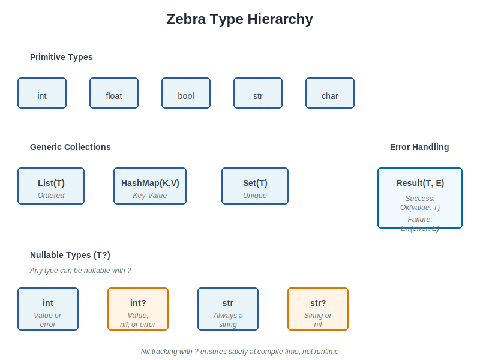

# Zebra Programming Book - Diagrams

This directory contains SVG diagrams that supplement the textual explanations in the Zebra Programming Book.

## Diagrams by Topic

### Fundamentals (Chapter 2-6)

1. **01-type-hierarchy.svg** (Chapter 2: Values and Types)
   - Visual representation of Zebra's type system
   - Primitive types, collections, nullable types, and Result type
   - Shows type relationships and conversions

2. **02-collections-comparison.svg** (Chapter 3: Collections)
   - Side-by-side comparison of List, HashMap, and Set
   - Visual memory layout and iteration patterns
   - Usage examples for each collection type

3. **03-scope-and-lifetime.svg** (Chapter 4: Functions and Scope)
   - Variable scope boundaries and lifetime
   - Nested scopes and visibility rules
   - Closure capture mechanics

4. **13-unicode-representation.svg** (Chapter 6: Strings and Unicode)
   - How Zebra represents strings internally
   - ASCII vs Unicode (UTF-8) encoding
   - String method operations

### Advanced Features (Chapter 11-15)

5. **04-type-narrowing.svg** (Chapter 11: Nil Tracking and Safety)
   - Type narrowing with nil checks
   - Compile-time type system guarantees
   - Before/after control flow examples

6. **05-error-propagation.svg** (Chapter 12: Error Handling)
   - How errors bubble up through Result types
   - Success vs error paths
   - Error propagation patterns

7. **06-generics-instantiation.svg** (Chapter 13: Generics)
   - Generic type templates and instantiation
   - Multiple type parameter substitution
   - Concrete type creation from generics

8. **07-pipeline-flow.svg** (Chapter 15: Pipelines)
   - Data flow through pipeline operators
   - Nested calls vs pipeline readability
   - Step-by-step pipeline execution

### Object-Oriented Programming (Chapter 7-9)

9. **10-class-hierarchy.svg** (Chapter 9: Inheritance)
   - Class hierarchy and inheritance chains
   - Method resolution with super calls
   - Parent and child class relationships

10. **12-class-structure.svg** (Chapter 7: Classes)
    - Class anatomy with fields and methods
    - Instance vs shared (static) members
    - Memory layout of objects

### Practical Projects (Chapter 16-18)

11. **08-project1-modules.svg** (Project 1: CLI Tool)
    - Module architecture and dependencies
    - Data flow from CLI args to output
    - Component responsibilities

12. **09-http-cycle.svg** (Project 2: HTTP Server)
    - HTTP request/response cycle
    - Router dispatch and handler processing
    - Client-server communication flow

13. **11-analysis-pipeline.svg** (Project 3: Text Analysis)
    - Data analysis pipeline steps
    - Frequency analysis and n-gram extraction
    - Similarity metrics comparison

## Using These Diagrams

### In Markdown
Reference diagrams in chapter markdown using standard image syntax:

```markdown

```

### In Presentations
SVGs can be:
- Embedded in HTML slides
- Exported to PNG/PDF using tools like Inkscape
- Used directly in Google Slides or PowerPoint (copy-paste)

### Editing
SVGs are text-based and can be edited with:
- Any text editor (change colors, text, dimensions)
- Inkscape (visual SVG editor)
- Adobe Illustrator
- Online tools like SVG-Edit

## Design Notes

### Consistent Styling
All diagrams use a unified color scheme:
- **Blue** (#0284c7): Main/primary elements
- **Green** (#16a34a): Output/success states
- **Purple** (#4f46e5): Processing steps
- **Amber** (#d97706): Warnings/special notes
- **Red** (#dc2626): Base/parent elements

### Accessibility
- High contrast text for readability
- Clear labels on all elements
- Monospace font for code snippets
- Descriptive titles and captions

### Scalability
- Vector-based (scales to any size)
- No raster/pixelated text
- Works on mobile and desktop
- Prints cleanly on paper

## Future Enhancements

Potential diagrams that could be added:
- Memory layout with garbage collection
- Macro expansion flow
- Compile-time vs runtime behavior
- Performance characteristics chart
- API design patterns
- Concurrency models (if added to Zebra)

## Contributing

To add or modify diagrams:
1. Create or edit SVG files in this directory
2. Follow the existing color scheme and style
3. Update this README with new diagram info
4. Test rendering in multiple browsers
5. Ensure high contrast for accessibility

---

**Last Updated:** April 7, 2026  
**Format:** SVG (Scalable Vector Graphics)  
**License:** Same as book content
